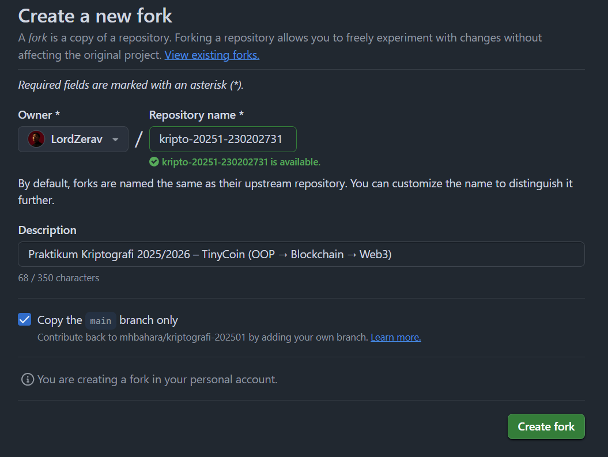
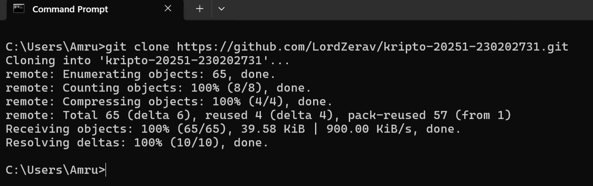
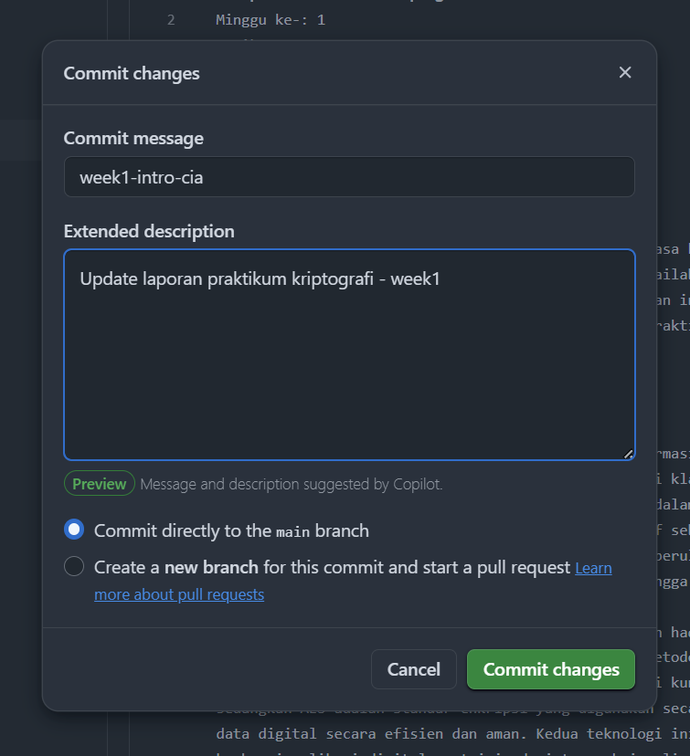

# Laporan Praktikum Kriptografi
Minggu ke-: 1
Topik: week1-intro-cia
Nama: Amru Muiz Fauzan
NIM: 230202731
Kelas: 5IKRA

---

## 1. Tujuan
- Menjelaskan sejarah dan evolusi kriptografi dari masa klasik hingga modern.
- Menyebutkan prinsip Confidentiality, Integrity, Availability (CIA) dengan benar.
- Menyimpulkan peran kriptografi dalam sistem keamanan informasi modern.
- Menyiapkan repositori GitHub sebagai media kerja praktikum

---

## 2. Dasar Teori
Sejarah kriptografi mencatat perkembangan seni dalam menyembunyikan informasi ini dimulai dari teknik-teknik klasik seperti Caesar Cipher pada abad ke-1 SM yang bekerja dengan mengganti setiap huruf dalam pesan berdasarkan pergesaran posisi tertentu dalam alfabet. Perkembangan berikutnya ditandai dengan kemunculan teknik Vignere Cipher pada abad ke-16 yang menggunakan kunci berulang dan tabel alfabet untuk menciptakan sistem enkripsi yang sangat kompleks dan sulit untuk dipecahkan sehingga menjadi penyempurnaan dari metode substitusi sederhana. Teknik-teknik klasik telah menjadi landasan fundamental untuk evolusi kriptografi menuju berbagai bentuk yang lebih maju dan beragam di era modern.

Perkembangan kriptografi masa modern ditandai dengan munculnya sebuah algoritma seperti RSA dan Advanced Encryption Standard (AES). RSA ini dikembangkan pada tahun 1977, merupakan metode kriptografi kunci publik yang memungkinkan untuk komunikasi aman tanpa harus berbagi kunci rahasia secara langsung karena menggunakan pasangan kunci publik dan privat yang berbeda fungsi. Kemudian AES menjadi standar enkripsi global sejak tahun 2001 dan masih banyak digunakan untuk melindungi data digital dengan kecepatan dan keamanan yang efisien. Kombinasi kedua metode tersebut juga sering digunakan dalam sistem enkripsi hibrida agar memaksimalkan keamanan serta performa agar terciptanya fondasi teknologi keamanan digital saat ini, terutama dalam transaksi online dan komunikasi pribadi.

Dalam era kontemporer, kriptografi berkembang dengan inovasi seperti blockchain dan cryptocurrency (Bitcoin). Blockchain mengaplikasikan kriptografi untuk menghasilkan sistem desentralisasi dan terdistribusi yang menjaga data tetap aman dan sulit dimanipulasi tanpa perlu otoritas pusat. Selain itu, konsep kriptografi kuantum dan homomorphic encryption sedang dikembangkan untuk memberikan tingkat keamanan yang lebih tinggi sesuai dengan tantangan teknologi digital masa depan. Dalam konteks keamanan informasi, ada tiga pilar utama yaitu confidentiality (kerahasiaan), integrity (integritas), dan availability (ketersediaan). Confidentiality menjaga agar data hanya dapat diakses oleh pihak yang berwenang, contohnya dapat dilihat pada email terenkripsi, proteksi SSL/TLS pada perbankan online, dan enkripsi end-to-end WhatsApp. Integrity menjamin data tidak dimodifikasi tanpa izin, dengan contoh pemeriksaan hash file, tanda tangan digital, dan verifikasi transaksi pembayaran. Availability memastikan akses data dan sistem tetap tersedia kapan pun dibutuhkan, contohnya backup server cloud, jaringan telekomunikasi nonstop, dan sistem layanan darurat yang selalu online.

---

## 3. Alat dan Bahan
- Terminal (CMD / Powershell)
- Git dan akun GitHub  

---

## 4. Langkah Percobaan
- Melakukan fork-repo kriptografi punya dosen.
- Melakukan clone-repo ke komputer lokal.
- Buat folder `praktikum/week1-intro-cia/` yang isinya file laporan.md dan folder screenshots.
- Menulis ringkasan sejarah kriptogri dan prinsip CIA beserta contoh nyata dalam aspek kehidupan.
- Menjawab quiz singkat.

---

## 5. Source Code
Untuk saat ini belum ada keperluan ngodingnya! Cuma ngelakuin fork-repo dan clone-repo
```python
git clone https://github.com/LordZerav/kripto-20251-230202731.git
```

---

## 6. Hasil dan Pembahasan


.

---

## 7. Jawaban Pertanyaan
1. Tokoh yang dianggap sebagai bapak kriptografi modern adalah **Claude Shannon**.
2. Algoritma kunci publik yang masih populer hingga kini yaitu **RSA**.
3. Perbedaan utama antara kriptografi klasik dengan kriptografi modern terletak pada kompleksitas metode enkripsi dan tingkat keamanannya. Metode pada kriptografi klasik adalah menggunakan enkripsi sederhana berbasis substitusi dan transposisi yang masih cukup mudah untuk dipecahkan dan biasanya digunakan secara manual. Berbeda dengan kriptografi modern yang menggunakan pendekatan matematis kuat serta kompleks dan untuk memproses data digital dengan tingkat keamanan yang tinggi tersebut perlu menggunakan komputer.

---

## 8. Kesimpulan
Sejarah kriptografi berkembang dari teknik klasik seperti Caesar Cipher yang sederhana dan manual kemudian beralih ke metode modern seperti RSA dan AES yang kompleks karena menggunakan matematika canggih dan komputer untuk mengamankan datanya. Pada era kontemporer juga menampilkan inovasi seperti blockchain dan kriptografi kuantum yang semakin meningkatkan keamanan dan desentralisasi data digital. Dalam praktik keamanan informasi, ketiga pilar utama yang dijaga adalah kerahasiaan, integritas dan ketersediaan dengan contoh nyata seperti enkripsi email, tanda tangan digital dan backup data pakai cloud.

---

## 9. Daftar Pustaka
- Katz, J., & Lindell, Y. *Introduction to Modern Cryptography*.  
- Stallings, W. *Cryptography and Network Security*. 
- p2dpt.uma.ac.id.(2024). _Sejarah Kriptografi: Dari Caesar Cipher hingga Blockhain_.
- ejournal.utp.ac.id. _Modifikasi Kriptografi Klasik Kombinasi Metode Vigenere._
- neliti.com. _Analisis Algoritma Kriptografi Klasik Caesar Cipher._
- ssldragon.com (2025). _Enkripsi RSA vs AES: Penjelasan Perbedaan Utama._
- Ieravio.com (2023). _Hubungan Kriptografi dengan Blockchain._
- isc2.org. _Security Principles: The CIA Triad._

---

## 10. Commit Log
```
commit week1-intro-cia
Author: Amru Muiz Fauzan <amrumuzan092@gmail.com>
Date:   2025-09-28

    week1-intro-cia: Meringkas terkait sejarah kriptografi

commit week1-intro-cia
Author: Amru Muiz Fauzan <amrumuzan092gmail.com>
Date:   2025-10-05

    week1-intro-cia: Revisi penulisan sejarah kriptografi, pengerjaan quiz serta merapihkan laporan.md dan menaruh dokumentasi di folder screenshots.
```
