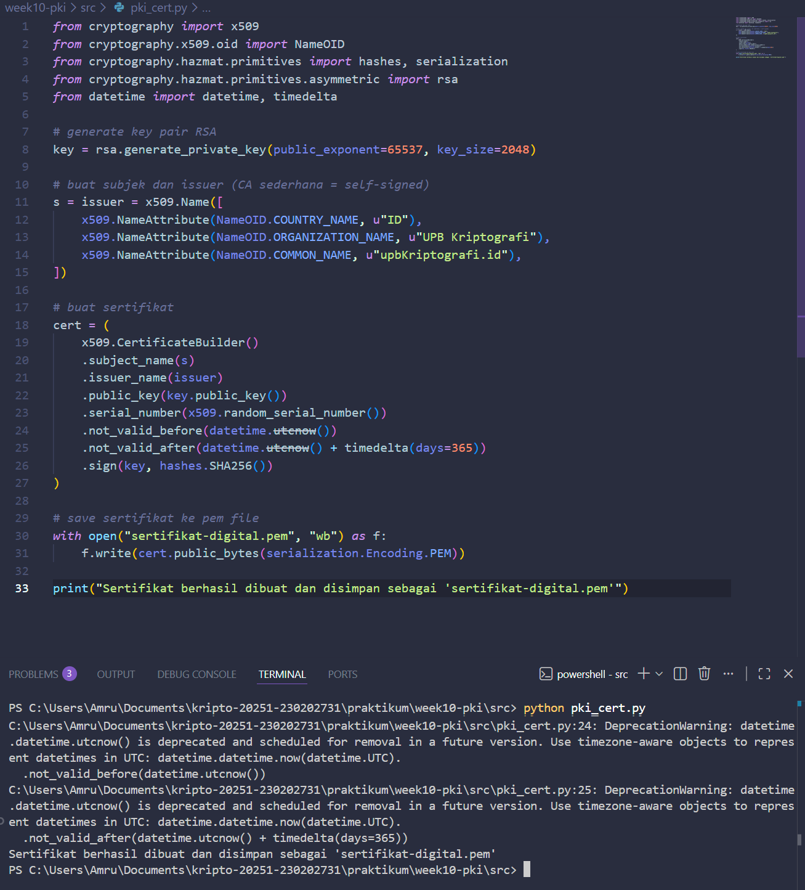
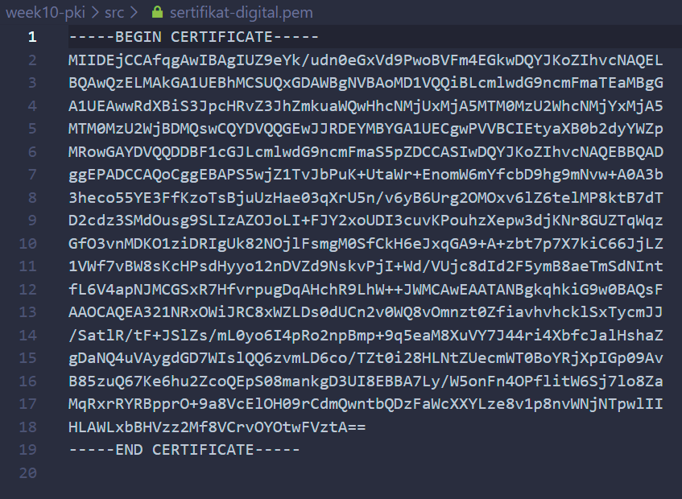

# Laporan Praktikum Kriptografi
Minggu ke-: 10
Topik: Public Key Infrastructure (PKI & Certificate Authority)
Nama: Amru Muiz Fauzan
NIM: 230202731
Kelas: 5IKRA  

---

## 1. Tujuan
```python
- Membuat sertifikat digital sederhana.
- Menjelaskan peran Certificate Authority (CA) dalam sistem PKI.
- Mengevaluasi fungsi PKI dalam komunikasi aman (contoh: HTTPS, TLS).
```

---

## 2. Dasar Teori
Certificate Authority (CA) merupakan entitas tepercaya dalam Public Key Infrastructure (PKI) yang bertanggung jawab menerbitkan, mengelola, dan mencabut sertifikat digital untuk mengikat kunci publik dengan identitas pemiliknya, sementara PKI adalah kerangka keseluruhan yang mengintegrasikan kriptografi kunci publik, sertifikat X.509, direktori sertifikat, serta kebijakan untuk mendukung komunikasi aman di jaringan terbuka. CA beroperasi dalam hierarki dengan Root CA di puncak yang menandatangani sertifikat Intermediate CA, memastikan rantai kepercayaan melalui tanda tangan digital yang diverifikasi secara berjenjang, sebagaimana dijelaskan dalam standar PKI yang mencakup Registration Authority (RA) untuk verifikasi identitas pemohon sebelum penerbitan sertifikat.

Peran utama CA meliputi verifikasi identitas entitas seperti individu, organisasi, atau perangkat melalui proses pendaftaran yang ketat, penerbitan sertifikat yang ditandatangani dengan kunci privat CA, serta pemeliharaan Certificate Revocation List (CRL) atau OCSP untuk mencabut sertifikat yang kompromi, sehingga PKI dapat mendeteksi dan menangani ancaman secara real-time. Dalam komunikasi aman, PKI memanfaatkan CA untuk mengaktifkan protokol seperti TLS/SSL pada HTTPS, VPN, dan email S/MIME, di mana sertifikat memvalidasi server agar pengguna menghindari serangan man-in-the-middle, sementara RA mendukung skalabilitas dengan menangani autentikasi lokal.

Kegunaan PKI dengan CA mencakup non-repudiasi melalui tanda tangan digital yang tidak dapat disangkal, autentikasi mutual antarpihak, serta enkripsi data end-to-end yang mencegah intersepsi, sehingga esensial untuk e-commerce, pemerintahan digital, dan IoT di mana kepercayaan atas identitas menjadi pondasi keamanan siber. Manfaatnya termasuk efisiensi distribusi kunci publik tanpa saluran aman terpisah, pengurangan risiko pemalsuan melalui validasi rantai sertifikat, dan kepatuhan regulasi seperti eIDAS di Eropa atau standar NIST di AS, menjadikan PKI sebagai tulang punggung infrastruktur keamanan modern.

---

## 3. Alat dan Bahan
```python
- Visual Studio Code
- Git dan akun GitHub  
- Python 3.11
```

---

## 4. Langkah Percobaan
```python
- Buat program simulasi pembuatan sertifikat digital dengan python atau OpenSSL.
- Buat laporan.md dan menjawab beberapa pertanyaan.
```

---

## 5. Source Code
```python
from cryptography import x509
from cryptography.x509.oid import NameOID
from cryptography.hazmat.primitives import hashes, serialization
from cryptography.hazmat.primitives.asymmetric import rsa
from datetime import datetime, timedelta

# generate key pair RSA
key = rsa.generate_private_key(public_exponent=65537, key_size=2048)

# buat subjek dan issuer (CA sederhana = self-signed)
s = issuer = x509.Name([
    x509.NameAttribute(NameOID.COUNTRY_NAME, u"ID"),
    x509.NameAttribute(NameOID.ORGANIZATION_NAME, u"UPB Kriptografi"),
    x509.NameAttribute(NameOID.COMMON_NAME, u"upbKriptografi.id"),
])

# buat sertifikat
cert = (
    x509.CertificateBuilder()
    .subject_name(s)
    .issuer_name(issuer)
    .public_key(key.public_key())
    .serial_number(x509.random_serial_number())
    .not_valid_before(datetime.utcnow())
    .not_valid_after(datetime.utcnow() + timedelta(days=365))
    .sign(key, hashes.SHA256())
)

# save sertifikat ke pem file
with open("sertifikat-digital.pem", "wb") as f:
    f.write(cert.public_bytes(serialization.Encoding.PEM))

print("Sertifikat berhasil dibuat dan disimpan sebagai 'sertifikat-digital.pem'")
```

---

## 6. Hasil dan Pembahasan



---

## 7. Jawaban Pertanyaan
```python
- Pertanyaan : Jelaskan bagaimana CA digunakan untuk menjamin keaslian sertifikat!
- Pertanyaan : Bagaimana browser memverifikasi sertifikat HTTPS?
- Pertanyaan : Apa yang terjadi jika CA palsu menerbitkan sertifikat?
- Pertanyaan : Mengapa PKI penting dalam komunikasi aman (misalnya transaksi online)?
```
- CA digunakan untuk memverifikasi identitas pemohon melalui proses ketat (seperti dokumen dan CSR), kemudian menandatangani sertifikat dengan kunci privat CA sendiri, sehingga penerima dapat memvalidasi tanda tangan tersebut menggunakan kunci publik CA untuk memastikan keaslian dan integritas.​
- Browser akan memeriksa rantai sertifikat hingga root CA tepercaya di trust store, validasi tanda tangan digital, masa berlaku, CRL/OCSP untuk status pencabutan, dan kesesuaian domain, sebelum menerima handshake TLS.​
- Yang akan terjadi adalah sertifikat palsu bisa diterima kalau root CA palsu ditambahkan ke trust store korban, memungkinkan MITM untuk dekripsi lalu lintas, pencurian data, atau impersonasi situs sah, merusak kepercayaan PKI secara keseluruhan.​
- Karena dengan PKI maka bisa menyediakan autentikasi server, enkripsi end-to-end, dan non-repudiasi via sertifikat CA, mencegah pemalsuan identitas, intersepsi data, dan penyangkalan transaksi di e-commerce, banking, dan HTTPS.​

```python
- Pertanyaan 1: Apa fungsi utama Certificate Authority (CA)?
- Pertanyaan 2: Mengapa self-signed certificate tidak cukup untuk sistem produksi?
- Pertanyaan 3: Bagaimana PKI mencegah serangan MITM dalam komunikasi TLS/HTTPS?
```
1. Menerbitkan, memverifikasi, dan mencabut sertifikat digital untuk mengikat kunci publik dengan identitas tepercaya dalam PKI.​
2. Tidak ada verifikasi independen, rentan pemalsuan identitas, dan browser/OS menolaknya karena kurang kepercayaan hierarki CA.​
3. Sertifikat CA memvalidasi identitas server via rantai kepercayaan, memastikan kunci publik asli sebelum handshake enkripsi.​

---

## 8. Kesimpulan
Certificate Authority (CA) dan Public Key Infrastructure (PKI) membentuk fondasi kepercayaan dalam kriptografi kunci publik, di mana CA menerbitkan sertifikat digital untuk mengikat kunci publik dengan identitas terverifikasi melalui hierarki rantai kepercayaan, sementara PKI mengintegrasikan sertifikat, CRL, dan protokol seperti TLS untuk autentikasi, enkripsi, serta non-repudiasi dalam komunikasi aman seperti HTTPS, VPN, dan tanda tangan digital, sehingga mencegah pemalsuan, man-in-the-middle, dan memastikan efisiensi keamanan siber modern tanpa saluran kunci terpisah.​

---

## 9. Daftar Pustaka
```python
- Stallings, W. (2017). Cryptography and network security: Principles and practice (7th ed.). Pearson (Chapter on PKI and Certificate Authorities).​
- Tanenbaum, A. S., & Wetherall, D. J. (2011). Computer networks (5th ed.). Pearson (Section on Public Key Infrastructure).​
- Paar, C., Pelzl, J., & Preneel, B. (2010). Understanding cryptography. Springer (PKI frameworks).​
- Rinaldi Munir. (n.d.). Public Key Infrastructure (PKI). Institut Teknologi Bandung. https://informatika.stei.itb.ac.id/~rinaldi.munir/Kriptografi/Public%20Key%20Infrastructure.pdf​
- National Institute of Standards and Technology. (2013). Digital Signature Standard (DSS) (FIPS 186-4). U.S. Department of Commerce. https://nvlpubs.nist.gov/nistpubs/fips/nist.fips.186-4.pdf​
- Katz, J., & Lindell, Y. (2020). Introduction to modern cryptography (3rd ed.). CRC Press (Chapter on PKI and CAs).​
```

## 10. Commit Log
```
commit week10-pki
Author: Amru Muiz Fauzan <amrumuzan092@gmail.com>
Date:   2025-12-09

    week10-pki: implementasi program python sertifikat digital dan menyelesaikan laporan.md
```
