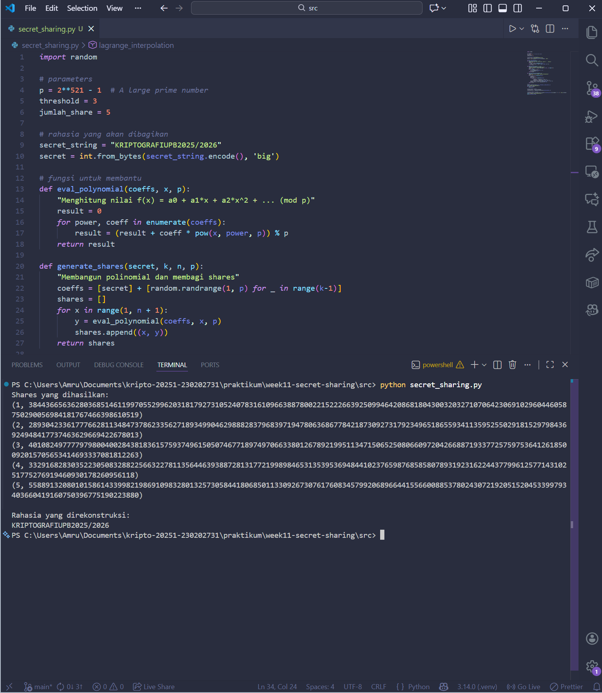

# Laporan Praktikum Kriptografi
Minggu ke-: 11  
Topik: Secret Sharing (Shamir's Secret Sharing)
Nama: Amru Muiz Fauzan  
NIM: 230202731
Kelas: 5IKRA  

---

## 1. Tujuan
```python
- Menjelaskan konsep Shamir Secret Sharing (SSS).
- Melakukan simulasi pembagian rahasia ke beberapa pihak menggunakan skema SSS.
- Menganalisis keamanan skema distribusi rahasia.
```

---

## 2. Dasar Teori
Shamir Secret Sharing (SSS) adalah skema pembagian rahasia yang memungkinkan sebuah kunci atau data rahasia dibagi menjadi beberapa bagian sedemikian rupa sehingga cuma modal ngumpulin sejumlah tertentu dari bagian-bagian itu, nanti rahasia aslinya bisa direkonstruksi, tetapi dengan jumlah yang lebih sedikit, tidak ada informasi apa pun tentang rahasia yang bisa diketahui. Shamir Secret Sharing adalah skema threshold (k,n) yang artinya sebuah rahasia S dibagi menjadi n buah share, kemudian direkontruksi rahasia tersebut dengan minimal k share (k <= n). Skema ini didasarkan pada interpolasi polinomial acak berderajat k-1 di atas suatu field sehingga (misal Fp), dengan syarat bahwa nilai polinomial di titik x = 0 merupakan rahasia S, yaitu f(0) = S. Kemudian, kita menghitung nilai polinomial tersebut di n titik x yang berbeda (misalnya x = 1, 2, ..., n) dan setiap pasangan (xi, f(xi)) menjadi satu share yang diberikan ke peserta. Karena polinomial derajat k-1 ditentukan secara unik oleh k titik. Maka dengan mengumpulkan k share, kita bisa menggunakan interpolasi Lagrange untuk mencari kembali polinomial lengkap dan membaca f(0) = S.
Keamanan SSS bersifat informasi-teoretik (information-theoretic security), artinya selama jumlah share yang diketahui kurang dari k, maka setiap kemungkinan nilai rahasia S tetap sama-sama mungkin, sehingga tidak ada informasi apa pun yang bocor. Dengan kata lain, meskipun seorang penyerang memiliki k−1 share, dia tidak bisa membedakan mana yang benar-benar merupakan rahasia yang benar, karena semua nilai S masih konsisten dengan share yang dimilikinya. Skema ini juga bersifat ideal: ukuran setiap share tidak lebih besar dari ukuran rahasia aslinya, dan setiap subset dari k share bisa merekonstruksi rahasia, sedangkan subset yang lebih kecil tidak bisa. Selain itu, SSS bersifat dinamis dan ekstensibel, artinya kita bisa menambah atau menghapus share tanpa harus mengubah rahasia atau share yang sudah ada, asalkan kita masih memegang cukup share untuk merekonstruksi polinomial.
SSS sangat fleksibel karena kita bisa memilih parameter k dan n sesuai kebutuhan keamanan dan ketersediaan. Misalnya, kita bisa membuat skema (3,5), artinya rahasia dibagi ke 5 orang, dan minimal 3 orang harus bekerja sama untuk membuka rahasia. Ini memungkinkan kita membangun kontrol akses yang lebih halus: rahasia tetap aman meskipun satu atau dua share hilang atau jatuh ke tangan musuh, tetapi tetap bisa diakses selama mayoritas peserta hadir. Skema ini banyak digunakan dalam praktik, misalnya untuk membagi kunci enkripsi, kunci wallet kripto, atau password master, sehingga tidak ada satu pun pihak yang memegang kunci penuh, tetapi kunci tetap bisa dipulihkan jika cukup banyak pihak yang bekerja sama.

---

## 3. Alat dan Bahan
- Visual Studio Code
- Git dan akun GitHub
- python 3.14
- Library secretsharing

---

## 4. Langkah Percobaan
```python
1. pip install secretsharing
2. implementasi shamir secret sharing dengan python
3. simulasi manual dengan polinomial modulo p
4. analisis keamanan
5. menjawab pertanyaan diskusi
6. menyelesaikan laporan.md
```

---

## 5. Source Code
```python
import random

# parameters
p = 2**521 - 1  # A large prime number
threshold = 3
jumlah_share = 5

# rahasia yang akan dibagikan
secret_string = "KRIPTOGRAFIUPB2025/2026"
secret = int.from_bytes(secret_string.encode(), 'big')

# fungsi untuk membantu
def eval_polynomial(coeffs, x, p):
    "Menghitung nilai f(x) = a0 + a1*x + a2*x^2 + ... (mod p)"
    result = 0
    for power, coeff in enumerate(coeffs):
        result = (result + coeff * pow(x, power, p)) % p
    return result

def generate_shares(secret, k, n, p):
    "Membangun polinomial dan membagi shares"
    coeffs = [secret] + [random.randrange(1, p) for _ in range(k-1)]
    shares = []
    for x in range(1, n + 1):
        y = eval_polynomial(coeffs, x, p)
        shares.append((x, y))
    return shares

def lagrange_interpolation(shares, p):
    "Rekonstruksi secret dengan Lagrange Interpolation"
    secret = 0
    for j, (xj, yj) in enumerate(shares):
        numerator = 1
        denominator = 1
        for m, (xm, _) in enumerate(shares):
            if m != j:
                numerator = (numerator * (-xm)) % p
                denominator = (denominator * (xj - xm)) % p
        lagrange_coeff = (numerator * pow(denominator, -1, p)) % p
        secret = (secret + yj * lagrange_coeff) % p
    return secret

# proses
shares = generate_shares(secret, threshold, jumlah_share, p)
print("Shares yang dihasilkan:")
for share in shares:
    print(share)
    
# milih minimal k shares
selected_shares = shares[:threshold]
recovered_secret = lagrange_interpolation(selected_shares, p)

# konversi kembali ke string
recovered_string = recovered_secret.to_bytes((recovered_secret.bit_length() + 7) // 8, 'big').decode()
print("\nRahasia yang direkonstruksi:")
print(recovered_string)
```

---

## 6. Hasil dan Pembahasan


---

## 7. Jawaban Pertanyaan
```
- Pertanyaan 1: Apa keuntungan utama Shamir Secret Sharing dibanding membagikan salinan kunci secara langsung?
- Pertanyaan 2: Apa peran threshold k dalam keamanan secret sharing?
- Pertanyaan 3: Berikan satu contoh skenario nyata di mana SSS sangat bermanfaat!
```

- Keuntungan utama karena tidak ada single point of failure dan keamanan informasi-teoretik. Jika kunci dibagi secara langsung misal semua orang dapet salinan penuh maka semua orang pun bisa memiliki satu salinan yang bisa langsung menggunakan kunci dan jika kehilangan satu salinan berarti kuncinya bisa dicuri. Dengan SSS, tidak ada satupun share yang akan berguna sendirian; kunci hanya akan bisa dibuka jika setidaknya k share dikumpulkan sehingga lebih aman dari pencurian share.
- Threshold k itu buat nentuin jumlah minimum share yang diperlukan buat merekontruksi rahasia dan sekaligus menentukan batas keamanan. Kalau penyerang cuma memiliki kurang dari k share maka dia tidak bisa mendapatkan informasi apa pun tentang rahasia tersebut karena semua kemungkinan nilai rahasia tetap sama. Dengan memilih k yang lebih besar kita akan membuat sistem lebih tahan terhadap kehilangan share tapi juga membutuhkan lebih banyak peserta untuk membuka rahasia tersebut.
- Penyimpanan kunci wallet kripto dengan skema SSS, misal seseorang membagi priv key menjadi 5 share dengan k = 3 lalu menyimpan share" tersebut di 5 tempat berbeda. Jika satu perangkat rusak atau satu share hilang maka kunci masih bisa dipulihkan selama beberapa share lainnya tersedia. Tapi jika cuma ada satu atau dua share yang dicuri, si pencuri juga gak akan bisa membuka wallet karena gak cukup share buat merekonstruksi kunci.

---

## 8. Kesimpulan
Shamir Secret Sharing memungkinkan sebuah rahasia dibagi menjadi beberapa bagian sehingga hanya dengan mengumpulkan sejumlah tertentu (threshold) bagian tersebut rahasia bisa direkonstruksi, sedangkan jumlah yang lebih sedikit tidak memberikan informasi apa pun tentang rahasia itu. Keunggulannya dibanding membagi salinan kunci langsung adalah tidak ada satu pun pihak yang memegang kunci penuh, sehingga lebih aman terhadap kehilangan atau pencurian sebagian share. Skema ini sangat berguna dalam skenario nyata seperti penyimpanan kunci kripto atau password master, di mana kita ingin tetap bisa memulihkan akses meskipun beberapa share hilang, tetapi tetap aman jika hanya sedikit share yang jatuh ke tangan yang salah

---
## 9. Daftar Pustaka
```python
- Stinson, D. R. (2019). Cryptography: Theory and Practice (edisi ke-4), Bab 11: Secret Sharing Schemes, khususnya bagian 11.1 “Introduction: The Shamir Threshold Scheme”.
- GeeksforGeeks: “Shamir’s Secret Sharing Algorithm | Cryptography”.
```

---

## 10. Commit Log
```python
commit week11-secret-sharing
Author: Amru Muiz Fauzan <amrumuzan092@gmail.com>
Date:   2025-12-30

    week11-cryptosystem: Shamir Secret Sharing (SSS)
```
