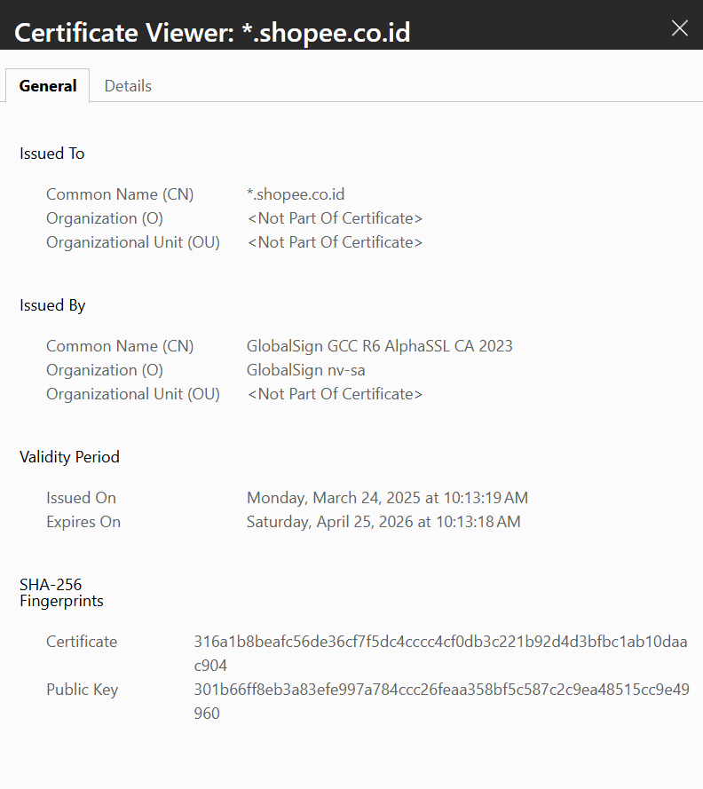

# Laporan Praktikum Kriptografi
Minggu ke-: 12
Topik: Aplikasi TLS & E-Commerce
Nama: Amru Muiz Fauzan
NIM: 230202731
Kelas: 5IKRA  

---

## 1. Tujuan
```python
- Menganalisis penggunaan kriptografi pada email dan SSL/TLS.
- Menjelaskan enkripsi dalam transaksi e-commerce.
- Mengevaluasi isu etika & privasi dalam penggunaan kriptografi di kehidupan sehari-hari.

```

---

## 2. Dasar Teori
Kriptografi pada email bertujuan untuk menjamin kerahasiaan, integritas, otentikasi, dan non-repudiasi pesan, karena email biasa (seperti SMTP/POP/IMAP) pada dasarnya tidak aman dan isinya bisa dibaca atau dimodifikasi selama transmisi maupun di server tujuan. Untuk itu, protokol seperti PGP (Pretty Good Privacy) dan S/MIME (Secure/Multipurpose Internet Mail Extensions) digunakan: pesan dienkripsi dengan kunci sesi simetris (misalnya AES), kunci sesi itu sendiri dienkripsi dengan kunci publik penerima, dan pesan juga ditandatangani digital dengan kunci privat pengirim agar penerima bisa memverifikasi identitas pengirim dan memastikan pesan tidak diubah. Dengan demikian, email yang diamankan secara kriptografi memastikan bahwa hanya penerima yang dituju yang bisa membaca isi pesan, serta penerima tahu pasti siapa pengirimnya dan pesan tersebut belum dimanipulasi.​
Protokol SSL/TLS dan enkripsi dalam transaksi e‑commerce memainkan peran sentral dalam melindungi data sensitif selama bertransaksi di internet, terutama melalui HTTPS. SSL/TLS bekerja di lapisan transport (antara browser dan server web) dengan melakukan handshake untuk menegosiasikan algoritma enkripsi, mengautentikasi server menggunakan sertifikat digital, dan kemudian mengenkripsi seluruh sesi komunikasi agar data seperti nomor kartu kredit, password, dan informasi pribadi tidak bisa dibaca oleh pihak ketiga. Dalam e‑commerce, skema ini memungkinkan pembayaran online yang aman, karena data pembayaran dikirim dalam bentuk terenkripsi, server terverifikasi identitasnya, dan integritas data dilindungi dengan MAC (Message Authentication Code), sehingga pelanggan bisa bertransaksi tanpa takut data mereka dicuri selama perjalanan di jaringan.
Di kehidupan sehari‑hari, kriptografi sangat penting untuk menjaga privasi komunikasi (seperti pesan instan, email, dan browsing), tetapi penggunaannya juga menimbulkan isu etika dan hukum yang kompleks. Di satu sisi, enkripsi memungkinkan individu mengontrol siapa yang boleh mengakses informasi pribadinya, sehingga mendukung hak atas privasi dan kebebasan berekspresi. Di sisi lain, enkripsi yang kuat juga bisa digunakan untuk menyembunyikan aktivitas ilegal (seperti terorisme, perdagangan narkoba, atau eksploitasi anak), sehingga menimbulkan dilema bagi pemerintah dan penegak hukum yang ingin melakukan penyadapan atau akses ke data dalam rangka keamanan nasional, yang berpotensi melanggar privasi warga jika tidak diatur secara hati‑hati dan transparan.

---

## 3. Alat dan Bahan
```python
- Mental
- Git dan akun GitHub  
- Kesabaran
- Browser
```

---

## 4. Langkah Percobaan
```python
1. Baca materi tentang penggunaan kriptografi pada email dan SSL / TLS
2. Analisis penggunaan kriptografi pada email dan SSL / TLS
3. Menjelaskan enkripsi dalam transaksi e-commerce
4. Mengevaluasi isu etika dan privasi dalam penggunaan kriptografi di kehidupan sehari-hari
```
Perbedaan antara website dengan HTTPS dan tanpa HTTPS itu bisa terlihat langsung di awal, website dengan HTTPS itu ada icon kunci di sebelah alamat url dan untuk website tanpa HTTPS itu muncul tulisan ``Not Secure`` di samping alamat url.

Studi kasus e-commerce
Enkripsi digunakan untuk melindungi transaksi online (seperti login dan pembayaran) dengan mengubah data sensitif — seperti username, password, nomor kartu kredit, dan OTP — menjadi bentuk acak (ciphertext) yang hanya bisa dibaca oleh pihak yang memiliki kunci dekripsi. Pada saat login atau pembayaran, komunikasi antara browser/aplikasi dan server dilindungi oleh protokol TLS (Transport Layer Security), yang membuat saluran komunikasi terenkripsi end‑to‑end sehingga data tidak bisa dibaca atau dimodifikasi oleh pihak ketiga selama perjalanan di jaringan. Jika TLS tidak digunakan (misalnya hanya HTTP biasa), maka semua data dikirim dalam bentuk teks biasa dan sangat rentan terhadap serangan seperti Man‑in‑the‑Middle (MitM). Dalam serangan MitM, penyerang bisa menyisipkan dirinya di antara klien dan server, lalu membaca semua data yang dikirim (termasuk password dan nomor kartu), bahkan memodifikasi transaksi (misalnya mengubah nomor rekening tujuan transfer) tanpa diketahui korban. Selain itu, tanpa TLS, korban juga tidak bisa memverifikasi identitas server, sehingga mudah tertipu oleh situs palsu (phishing) yang tampak seperti situs asli.​ Karena itu, enkripsi TLS sangat krusial: ia tidak hanya menjaga kerahasiaan data login dan pembayaran, tetapi juga menjamin integritas (data tidak diubah) dan otentikasi (server yang dituju adalah server yang benar). Dengan TLS, meskipun penyerang bisa mengintip lalu lintas jaringan (misalnya di Wi‑Fi publik), ia hanya melihat data terenkripsi yang tidak berguna tanpa kunci, sehingga transaksi online tetap aman selama protokol ini digunakan dengan benar.

Isu privasi dalam penggunaan email terenskripsi
Email terenkripsi dengan PGP atau S/MIME memang sangat kuat dalam melindungi privasi, karena komunikasi bersifat end‑to‑end: hanya pengirim dan penerima yang bisa membaca isi pesan, sedangkan penyedia layanan email (ISP/email provider) hanya melihat data terenkripsi. Namun, ini menimbulkan isu privasi, terutama di lingkungan kerja: jika karyawan menggunakan email kantor yang terenkripsi, perusahaan tidak bisa lagi memantau isi komunikasi untuk keperluan audit, kepatuhan (compliance), atau investigasi pelanggaran kebijakan, sehingga bisa menghambat pengawasan internal.
​
Dilema etika: boleh gak perusahaan dekripsi email karyawannya?
Secara etika, perusahaan boleh melakukan audit komunikasi karyawan hanya jika ada kebijakan yang jelas, transparan, dan sesuai hukum. Di banyak negara, termasuk Indonesia, perusahaan diperbolehkan memantau komunikasi karyawan yang menggunakan sistem perusahaan (termasuk email kantor), tetapi harus berdasarkan peraturan internal yang telah disosialisasikan dan, dalam banyak kasus, memerlukan persetujuan atau dasar hukum yang sah (misalnya untuk keamanan, kepatuhan, atau investigasi pelanggaran). Namun, jika email karyawan dienkripsi end‑to‑end (PGP/S/MIME), maka perusahaan tidak bisa membaca isi pesan tanpa kunci pribadi karyawan, yang menimbulkan dilema: di satu sisi, perusahaan berhak melindungi aset dan kepatuhan; di sisi lain, membuka email terenkripsi tanpa izin bisa dianggap pelanggaran privasi dan melanggar hak asasi karyawan.

Bagaimana terkait kebijakan pemerintah terhadap pengawasan komunikasi terenskripsi?
Pemerintah di banyak negara menghadapi dilema serupa: mereka ingin bisa mengawasi komunikasi untuk keamanan nasional dan penegakan hukum, tetapi kriptografi end‑to‑end membuat komunikasi sangat sulit diakses. Beberapa pemerintah mendorong atau mewajibkan “backdoor” atau mekanisme dekripsi khusus bagi otoritas, tetapi pendekatan ini dikritik karena melemahkan keamanan secara umum dan bisa disalahgunakan untuk pengawasan massal. Di sisi lain, kebijakan yang terlalu membatasi enkripsi (misalnya melarang atau membatasi penggunaan PGP/S/MIME) dianggap mengancam privasi warga dan kepercayaan terhadap layanan digital. Oleh karena itu, banyak negara berusaha menyeimbangkan antara keamanan nasional dan hak privasi, misalnya dengan membatasi pengawasan hanya pada kasus tertentu (dengan izin pengadilan) dan tidak mengharuskan backdoor yang merusak keamanan sistem secara keseluruhan.

​
---

## 5. Source Code
```python
ada?
```

---

## 6. Hasil dan Pembahasan


---

## 7. Jawaban Pertanyaan
```python
- Pertanyaan 1: Apa perbedaan utama antara HTTP dengan HTTPS?
- Pertanyaan 2: Mengapa sertifikat digital menjadi penting dalam komunikasi TLS?
- Pertanyaan 3: Bagaimana kriptografi mendukung privasi dalam komunikasi digital, tetapi sekaligus menimbulkan tantangan hukum dan etika?
```

- Perbedaan utamanya adalah HTTPS menggunakan enkripsi (melalui SSL/TLS) sedangkan HTTP tidak. HTTP mengirimkan data (termasuk URL, header, dan isi halaman) dalam bentuk teks biasa, sehingga mudah dibaca oleh siapa pun yang bisa mengintip lalu lintas jaringan (misalnya di Wi‑Fi publik). HTTPS, yang merupakan HTTP yang dibungkus dengan SSL/TLS, mengenkripsi seluruh komunikasi antara browser dan server, sehingga isi halaman, data login, dan informasi pembayaran tidak bisa dibaca oleh pihak ketiga.
- Sertifikat digital penting karena berfungsi sebagai “identitas” server yang bisa diverifikasi oleh klien (misalnya browser). Saat klien terhubung ke server via TLS, server mengirimkan sertifikatnya yang berisi nama domain, kunci publik, dan tanda tangan dari otoritas sertifikasi (CA) tepercaya. Dengan memverifikasi sertifikat ini, klien bisa memastikan bahwa ia sedang berkomunikasi dengan server yang benar (bukan server palsu/menyerupai), sehingga mencegah serangan seperti man‑in‑the‑middle.
- Kriptografi mendukung privasi dengan memastikan bahwa hanya pihak yang berhak yang bisa membaca komunikasi (kerahasiaan), serta melindungi integritas dan identitas pengirim (otentikasi dan non‑repudiasi). Namun, karena enkripsi yang kuat bisa menyembunyikan aktivitas ilegal, muncul tantangan hukum dan etika: pemerintah ingin memiliki kemampuan untuk mengakses komunikasi terenkripsi demi keamanan nasional, tetapi hal ini bisa mengarah pada pengawasan massal dan pelanggaran hak privasi jika tidak dikendalikan dengan aturan yang jelas dan adil.

---

## 8. Kesimpulan
Kriptografi pada email dan SSL/TLS memastikan komunikasi dan transaksi online tetap rahasia, utuh, dan terotentikasi, terutama dalam e‑commerce dan layanan web. HTTPS (HTTP + TLS) lebih aman dari HTTP karena semua data dikirim terenkripsi dan identitas server diverifikasi lewat sertifikat digital. Meski kriptografi sangat penting untuk privasi, penggunaannya juga menimbulkan dilema etika dan hukum karena bisa melindungi aktivitas ilegal sekaligus melindungi hak individu.

---

## 9. Daftar Pustaka
```python
- Stallings, W. (2017). Cryptography and network security: Principles and practice (7th ed.). Pearson.
- WinPay. (2025, 17 Maret). Cara kerja pembayaran online dan teknologinya dalam transaksi. https://www.winpay.id/cara-kerja-pembayaran-online-dan-teknologinya-dalam-transaksi/
- Bank Neo Commerce. (2024, 17 April). Keamanan transaksi di bank digital, kamu wajib tahu!. https://www.bankneocommerce.co.id/id/news/keamanan-transaksi-di-bank-digital-kamu-wajib-tahu
- Bersama. (2024, 15 Agustus). Pentingnya perlindungan data nasabah pada aplikasi pembayaran online. https://bersama.id/news/pentingnya-perlindungan-data-nasabah-pada-aplikasi-pembayaran-online
- Ottocash. (2024, 23 Januari). Ini dia standar keamanan sistem pembayaran online yang harus kamu tahu. https://ottopay.id/blog/artikel/mengenal-standar-keamanan-sistem-pembayaran-online/
- CodePolitan. (2024, 31 Januari). Mengenal apa itu enkripsi? Pengertian & manfaat yang harus kamu tahu. https://codepolitan.com/blog/mengenal-apa-itu-enkripsi-pengertian-manfaat-yang-harus-kamu-tahu
- Cring. (2025, 11 Maret). Teknologi enkripsi untuk keamanan transaksi digital. https://www.cring.id/post/teknologi-enkripsi
- Scribd. (2025, 14 Juli). Makalah keamanan e-mail (Pretty Good Privacy (PGP)). https://id.scribd.com/document/814443466/Makalah-Keamanan-E-mail-Pretty-Good-Privacy-PG
- BBC Indonesia. (2016, 12 Januari). Perusahaan boleh membaca email pribadi karyawan. https://www.bbc.com/indonesia/majalah/2016/01/160113_majalah_email_pribadi
- Hukumonline. (2022, 22 November). Bolehkah perusahaan mengakses e-mail karyawannya? https://www.hukumonline.com/klinik/a/bolehkah-perusahaan-mengakses-e-mail-karyawannya-lt52cd056c6a907/
- Hukumonline. (2022, 16 November). Batasan akses data pribadi pegawai oleh perusahaan. https://www.hukumonline.com/klinik/a/batasan-akses-data-pribadi-pegawai-oleh-perusahaan-lt5d0b056a7eb05/
- SSL Indonesia. (n.d.). Enkripsi S/MIME pada sertifikat SSL. https://sslindonesia.com/enkripsi-s-mime-pada-sertifikat-ssl/
- Munir, R. (2005). Peraturan mengenai kriptografi, menjaga privasi atau mengancam keamanan? Informatika STEI ITB. https://informatika.stei.itb.ac.id/~rinaldi.munir/Kriptografi/2005-2006/Makalah/Makalah2005-09.pdf
- Munir, R. (2006). Studi mengenai secure email dengan aplikasi PEM dan PGP. Informatika STEI ITB. https://informatika.stei.itb.ac.id/~rinaldi.munir/Kriptografi/2006-2007/Makalah1/Makalah1-046.pdf

```

---

## 10. Commit Log
```
commit week12-aplikasi-tls
Author: Amru Muiz Fauzan <amrumuzan092@gmail.com>
Date:   2025-12-30

    week12-aplikasi-tls: penerapan SSL / TLS (email dan e-commerce)
```
