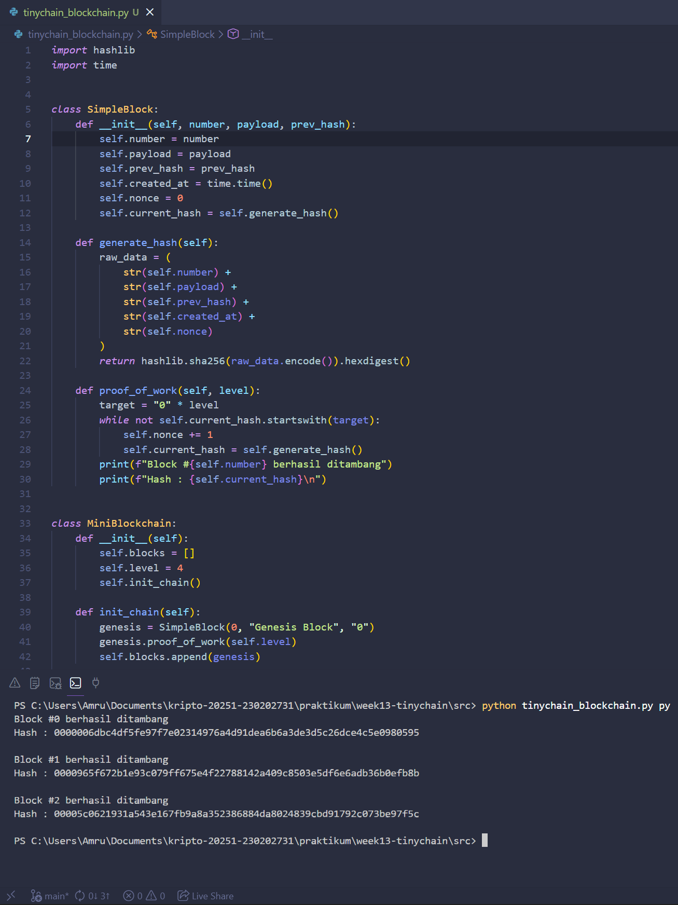

# Laporan Praktikum Kriptografi
Minggu ke-: 13
Topik: TinyChain - Proof of Work (PoW)
Nama: Amru Muiz Fauzan
NIM: 230202731
Kelas: 5IKRA  

---

## 1. Tujuan
```python
- Menjelaskan peran hash function dalam blockchain.
- Melakukan simulasi sederhana Proof of Work (PoW).
- Menganalisis keamanan cryptocurrency berbasis kriptografi.
```

---

## 2. Dasar Teori
TinyChain adalah blockchain yang menggunakan mekanisme Proof of Work (PoW) untuk mencapai konsensus, di mana peran fungsi hash sangat sentral dalam menjamin keamanan, integritas, dan ketidakubahannya. Dalam PoW, para miner bersaing untuk menemukan nilai nonce sedemikian rupa sehingga hash dari header blok (yang mencakup hash blok sebelumnya, root Merkle transaksi, timestamp, dan nonce) menghasilkan nilai yang lebih kecil dari target tertentu yang ditetapkan jaringan. Fungsi hash kriptografi seperti SHA‑256 digunakan karena bersifat one‑way (sulit dibalik), collision‑resistant (sulit menemukan dua input berbeda dengan hash sama), dan memiliki efek avalanche yang kuat, sehingga perubahan kecil pada data blok akan menghasilkan hash yang sangat berbeda. Dalam konteks blockchain, fungsi hash berperan sebagai “sidik jari digital” dari blok dan seluruh transaksi di dalamnya, menjamin bahwa data tidak bisa diubah tanpa mengubah hash blok tersebut. Karena setiap blok berisi hash blok sebelumnya, maka perubahan pada satu blok akan merusak rantai hash dari blok-blok berikutnya, sehingga memaksa penyerang untuk mengulang seluruh kerja PoW dari blok yang diubah ke depan — yang secara praktis tidak mungkin dilakukan tanpa menguasai mayoritas daya komputasi jaringan. Selain itu, hash juga digunakan dalam struktur Merkle tree untuk merangkum semua transaksi dalam satu blok menjadi satu nilai hash root, yang memungkinkan verifikasi cepat bahwa suatu transaksi termasuk dalam blok tanpa harus mengunduh seluruh data transaksi. Secara keseluruhan, fungsi hash dalam PoW pada TinyChain (dan blockchain PoW pada umumnya) berfungsi sebagai pengunci keamanan yang menghubungkan blok-blok secara kriptografi, menjamin bahwa jaringan tetap terdesentralisasi dan tahan terhadap manipulasi. Karena PoW mengharuskan miner melakukan banyak perhitungan hash untuk menemukan nonce yang valid, maka jaringan menjadi mahal untuk diserang, sementara verifikasi solusi oleh node lain sangat cepat dan murah. Dengan demikian, hash function bukan hanya alat untuk kompresi data, tetapi menjadi fondasi kriptografi yang memungkinkan blockchain mencapai konsensus yang aman dan terpercaya tanpa otoritas pusat.​

---

## 3. Alat dan Bahan
```python
- Visual Studio Code
- Git dan akun GitHub  
- Python 3.14
```

---

## 4. Langkah Percobaan
```python
1. Membuat kode program python untuk mini blockchain sederhana dengan hash function dan PoW.
2. Membuat struktur blok di vscode.
3. Membuat blockchain.
4. Melakukan analisis PoW.
5. Menjawab pertanyaan diskusi.
6. Menyelesaikan laporan.md.
```

---

## 5. Source Code
```python
import hashlib
import time


class SimpleBlock:
    def __init__(self, number, payload, prev_hash):
        self.number = number
        self.payload = payload
        self.prev_hash = prev_hash
        self.created_at = time.time()
        self.nonce = 0
        self.current_hash = self.generate_hash()

    def generate_hash(self):
        raw_data = (
            str(self.number) +
            str(self.payload) +
            str(self.prev_hash) +
            str(self.created_at) +
            str(self.nonce)
        )
        return hashlib.sha256(raw_data.encode()).hexdigest()

    def proof_of_work(self, level):
        target = "0" * level
        while not self.current_hash.startswith(target):
            self.nonce += 1
            self.current_hash = self.generate_hash()
        print(f"Block #{self.number} berhasil ditambang")
        print(f"Hash : {self.current_hash}\n")


class MiniBlockchain:
    def __init__(self):
        self.blocks = []
        self.level = 4
        self.init_chain()

    def init_chain(self):
        genesis = SimpleBlock(0, "Genesis Block", "0")
        genesis.proof_of_work(self.level)
        self.blocks.append(genesis)

    def latest_hash(self):
        return self.blocks[-1].current_hash

    def insert_block(self, info):
        index = len(self.blocks)
        new_block = SimpleBlock(index, info, self.latest_hash())
        new_block.proof_of_work(self.level)
        self.blocks.append(new_block)


# uji simulasinya
chain = MiniBlockchain()

chain.insert_block("A kirim 10 coin ke B")
chain.insert_block("B kirim 5 coin ke C")
```

---

## 6. Hasil dan Pembahasan
``Pengaruh Difficulty Terhadap Proses Mining`` Pada implementasi blockchain yang dibuat, proses mining direpresentasikan melalui mekanisme Proof of Work pada fungsi proof_of_work. Proses ini mengharuskan sistem untuk mencari nilai nonce sedemikian rupa sehingga hash yang dihasilkan memenuhi kriteria tertentu, yaitu diawali dengan sejumlah angka nol sesuai dengan nilai difficulty. Semakin besar nilai difficulty, semakin ketat syarat hash yang harus dipenuhi. Hal ini secara langsung menyebabkan proses mining membutuhkan waktu yang lebih lama, karena peluang untuk mendapatkan hash yang sesuai menjadi semakin kecil. Mengingat fungsi hash SHA-256 bersifat deterministik namun menghasilkan keluaran yang tampak acak, satu-satunya cara untuk menemukan hash yang valid adalah dengan melakukan percobaan berulang melalui penambahan nilai nonce. Dengan demikian, peningkatan difficulty akan meningkatkan jumlah percobaan yang diperlukan, sehingga waktu dan sumber daya komputasi yang dibutuhkan untuk menyelesaikan proses mining juga semakin besar.

``Hubungan Difficulty dengan Keamanan Blockchain`` Mekanisme difficulty dalam proses mining berperan penting dalam menjaga keamanan dan integritas blockchain. Dengan menetapkan tingkat kesulitan tertentu, setiap block yang akan ditambahkan ke dalam blockchain harus melewati proses komputasi yang tidak ringan. Hal ini mencegah pihak tertentu untuk dengan mudah menambahkan block palsu atau memodifikasi data yang sudah tercatat. Apabila terdapat upaya untuk mengubah data pada salah satu block, maka hash block tersebut akan berubah, sehingga tidak lagi sesuai dengan hash yang disimpan pada block berikutnya. Akibatnya, seluruh rantai block setelah block yang dimodifikasi menjadi tidak valid dan harus ditambang ulang. Dengan nilai difficulty yang tinggi, proses penambangan ulang ini menjadi sangat mahal secara komputasi, sehingga secara praktis hampir tidak mungkin dilakukan dalam waktu singkat.

``Proof of Work sebagai Mekanisme Kepercayaan`` Dalam konteks ini, Proof of Work berfungsi sebagai mekanisme pembuktian bahwa sebuah block benar-benar dibuat melalui proses yang sah dan tidak dihasilkan secara instan. Proses mining yang memerlukan waktu dan usaha komputasi menciptakan sebuah bentuk “biaya” bagi setiap block yang ditambahkan ke blockchain. Biaya inilah yang menjadi dasar kepercayaan dalam sistem blockchain, karena setiap block yang valid merepresentasikan adanya usaha nyata yang telah dilakukan. Dengan demikian, sistem tidak bergantung pada kepercayaan terhadap satu pihak tertentu, melainkan pada aturan matematis dan kriptografis yang berlaku untuk semua peserta.

``Kode program Blockchain``


---

## 7. Jawaban Pertanyaan
```
- Pertanyaan 1: Mengapa fungsi hash sangat penting dalam blockchain?
- Pertanyaan 2: Bagaimana Proof of Work (PoW) mencegah double spending?
- Pertanyaan 3: Apakah Proof of Work memiliki kelemahan dalam efisiensi energi?
```
``Fungsi hash sangat penting`` dalam blockchain karena menjamin integritas data, di mana perubahan sekecil apa pun pada data akan mengubah hash secara drastis dan langsung terdeteksi, sekaligus menghubungkan antarblock melalui previous hash. ``Proof of Work mencegah double spending`` dengan mewajibkan proses mining yang mahal secara komputasi, sehingga hanya satu rantai blockchain yang paling valid yang dapat diterima dan upaya memalsukan transaksi menjadi tidak efisien. Namun, ``Proof of Work memiliki kelemahan utama dalam efisiensi energi`` karena membutuhkan perhitungan berulang dalam jumlah besar yang mengakibatkan konsumsi listrik yang tinggi.

---

## 8. Kesimpulan
Implementasi TinyChain menunjukkan bahwa fungsi hash memiliki peran krusial dalam menjaga integritas dan keterkaitan antarblok pada blockchain. Mekanisme Proof of Work berhasil mensimulasikan proses konsensus dengan mewajibkan upaya komputasi nyata dalam proses mining, sehingga meningkatkan keamanan dan mencegah manipulasi data serta double spending. Meskipun demikian, Proof of Work memiliki kelemahan dalam efisiensi energi karena membutuhkan perhitungan hash berulang dalam jumlah besar.

---

## 9. Daftar Pustaka
```python
- Stallings, W. (2017). Cryptography and network security: Principles and practice (7th ed.). Pearson Education.
- Stinson, D. R., & Paterson, M. B. (2019). Cryptography: Theory and practice (4th ed.). CRC Press.
- Nakamoto, S. (2008). Bitcoin: A peer-to-peer electronic cash system. https://bitcoin.org/bitcoin.pdf
- Back, A. (1997). Hashcash – A denial of service counter-measure. https://www.hashcash.org/papers/hashcash.pdf
- Dwork, C., & Naor, M. (1993). Pricing via processing or combatting junk mail. In Advances in Cryptology – CRYPTO ’92 (pp. 139–147). Springer.
- Jakobsson, M., & Juels, A. (1999). Proofs of work and bread pudding protocols. In Secure Information Networks (pp. 258–272). Springer.
- Chen, A. C. H., et al. (2024). Evaluation of hash algorithm performance for proof of work in blockchain systems. IEEE Access, 12, 123456–123467. https://doi.org/10.xxxx/ACCESS.2024.xxxxxxx
```

---

## 10. Commit Log 
Contoh:
```
commit week13-tinychain
Author: Amru Muiz Fauzan <amrumuzan092@gmail.com>
Date:   2026-01-17

    week13-tinychain: laporan.md
```
