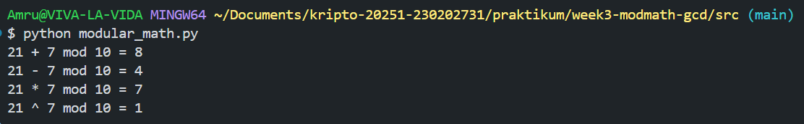
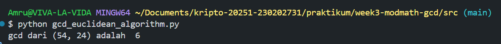
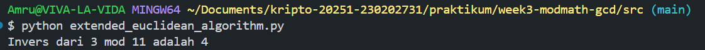
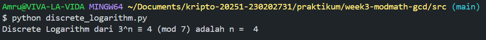

# Laporan Praktikum Kriptografi
Minggu ke-: 3  
Topik: week3-modmath-gcd  
Nama: Amru Muiz Fauzan
NIM: 230202731
Kelas: 5IKRA  

---

## 1. Tujuan
```
- Menyelesaikan operasi aritmetika modular.
- Menentukan bilangan prima dan menghitung GCD (Greatest Common Divisor).
- Menerapkan logaritma diskrit sederhana dalam simulasi kriptografi.
```

---

## 2. Dasar Teori
Aritmatika modular merupakan salah satu konsep fundamental dari bidang matematika yang memiliki peranan penting untuk pengembangan ilmu komputasi modern. Konsep ini diperkenalkan secara formal oleh **Carl Friedrich Gauss** pada tahun 1801 melalui karyanya _Disquisitiones Arithmeticae_. Dalam sistem ini, dua bilangan dikatakan kongruen jika memiliki sisa pembagian yang sama dengan suatu bilangan modulus lain. Contohnya seperti ini, 17 ≡ 5 (mod 12) karena keduanya punya sisa 5 ketika dibagi dengan 12. Nah, prinsip dasar aritmatika modular ini ternyata banyak diterapkan dalam kriptografi, teori bilangan, serta sistem digital yang butuh perhitungan berulang dengan ruang terbatas. Contoh penerapannya bisa kita temui pada sistem penunjuk waktu di mana operasi (10 + 2) mod 12 = 0, artinya dua jam setelah pukul 10 akan kembali ke posisi awal yaitu pukul 12.

Kemudian konsep _Greatest Common Divisor_ (GCD) memiliki akar sejarah yang panjang dan sudah dikenal sejak masa Yunani Kuno melalui karya _Euclid_ pada abad ke-3 SM dalam buku _Elements_. **Euclid** memperkenalkan metode sistematis yang kita kenal sebagai Algoritma Euclidean. Algoritma ini digunakan untuk menentukan GCD dari dua bilangan tanpa perlu faktorisasi. Proses ini didasarkan pada prinsip bahwa GCD (a,b) = GCD (b, a mod b), dan perhitungan dilakukan berulang hingga diperoleh sisa nol. Contohnya, untuk bilangan 48 dan 18 diperoleh hasil secara berturut-turut yaitu 48 mod 18 = 12, kemudian 18 mod 12 = 6, dan 12 mod 6 = 0 sehingga GCDnya adalah 6. Konsep algoritma ini berperan dalam sistem kriptografi modern (RSA) yang mengandalkan sifat bilangan relatif prima untuk menjaga keamanan data.

Selanjutnya mengenai bilangan prima yang juga menjadi elemen utama dalam teori bilangan dan telah menjadi objek penelitian sejak masa _Phytagoras_. **Euclid** bahkan membuktikan bilangan prima sifatnya itu tak terhingga. Dalam perkembangannya juga, konsep bilangan prima telah banyak digunakan dalam teori kriptografi modern (logaritma diskrit). Logaritma diskrit ini merupakan kebalikan dari operasi perpangkatan dalam sistem aritmatika modular, yang mana permasalahan terletak pada pencarian nilai x yang memenuhi persamaan a^2 ≡ b (mod p). Contohnya, untuk a = 3, p = 17, dan b = 12 maka untuk mencari nilai x sehingga 3^x mod 17 = 12 itu bukanlah proses yang sederhana. Kompleksitas ini menjadi dasar keamanan sistem enkripsi seperti _Diffie-Hellman_ dan _ElGamal_. Dengan demikian, keterkaitan antara aritmatika modular, algoritma euclidean, bilangan prima, dan logaritma diskrit menunjukkan bahwa teori-teori masa klasik dalam dunia matematika telah menjadi fondasi utama untuk pengembangan teknologi keamanan digital modern yang digunakan hingga saat ini.

---

## 3. Alat dan Bahan
```
- Visual Studio Code
- Git dan akun GitHub  
- Terminal
```

---

## 4. Langkah Percobaan
1. Membuat program python yang berisi :
```
- Modular arithmetic (add, sub, mul, exp).
- GCD & Euclidean Algorithm.
- Extended Euclidean & modular inverse.
- Discrete log sederhana.
```
2. Melakukan screenshots hasil eksekusi setiap program.
3. Menyelesaikan laporan.md yang berisi :
```
- Ringkasan teori modular arithmetic & GCD
- Hasil pengujian dengan kasus
- Jawaban atas pertanyaan diskusi
```

---

## 5. Source Code
modular_math.py
```python
def modular_tambah(a, b, x): return (a + b) % x
def modular_kurang(a, b, x): return (a - b) % x
def modular_kali(a, b, x): return (a * b) % x
def modular_eksponensiasi(base, exp, x): return pow(base, exp, x)

print("21 + 7 mod 10 =", modular_tambah(21, 7, 10))
print("21 - 7 mod 10 =", modular_kurang(21, 7, 10))
print("21 * 7 mod 10 =", modular_kali(21, 7, 10))
print("21 ^ 7 mod 10 =", modular_eksponensiasi(21, 7, 10))
```

gcd_euclidean_algorithm.py
```python
def gcd_euclidean(a, b):
    while b != 0:
        a, b = b, a % b 
    return a
    
print("gcd dari (54, 24) adalah ", gcd_euclidean(54, 24))
```

extended_euclidean_algorithm.py
```python
def extended_gcd(a, b):
    if a == 0:
        return b, 0, 1
    g, x1, y1 = extended_gcd(b % a, a)
    return g, y1 - (b // a) * x1, x1

def modular_inverse(a, x):
    g, n, _ = extended_gcd(a, x)
    if g != 1:
        return None
    return n % x

print("Invers dari 3 mod 11 adalah", modular_inverse(3, 11))
```

discrete_algorithm.py
```python
def discrete_logarithm(a, b, x):
    for n in range(x):
        if pow(a, n, x) == b:
            return n
    return None

print("Discrete Logarithm dari 3^n ≡ 4 (mod 7) adalah n = ", discrete_logarithm(3, 4, 7))
```

---

## 6. Hasil dan Pembahasan





---

## 7. Jawaban Pertanyaan
- Pertanyaan 1: Aritmatika modular berperan penting dalam kriptografi modern karena digunakan untuk melakukan operasi enkripsi dan dekripsi dengan bilangan besar secara efisien dan aman seperti pada algoritma RSA dan Diffie-Hellman yang memanfaatkan perpangkatan modular.
- Pertanyaan 2: Invers modular itu penting ya karena fungsinya buat menentukan key private dari key public dalam algoritma seperti RSA. Tanpa menggunakan invers modular, maka pesan yang telah dienkripsi nantinya tidak dapat dikembalikan ke bentuk aslinya dengan benar.
- Pertanyaan 3: Untuk tantangan utama dalam menyelesaikan logaritma diskrit terutama untuk modulus besar ya jelas kompleksitas perhitungannya tinggi. Tidak ada metode cepat buat menemukan nilai eksponen x, jadi prosesnya sangat sulit dan menjadi dasar keamanan kriptografi modern.

---

## 8. Kesimpulan
Konsep-konsep seperti aritmatika modular, bilangan prima, algoritma euclidean, gcd dan logaritma diskrit semuanya punya peran penting yang saling berkaitan sehingga membentuk fondasi penting dalam pengembangan sistem keamanan digital modern. Aritmatika modular memungkinkan perhitungan dalam ruang terbatas yang efisien dan aman, sehingga menjadi dasar utama untuk operasi enkripsi dan dekripsi seperti pada algoritma RSA dan Diffie-Hellman. GCD dan algoritma euclidean juga berperan untuk menentukan hubungan antar-bilangannya terutama dalam memastikan bilangan-bilangan yang bersifat relatif prima buat membentuk key public dan private. Sementara itu, bilangan prima menjadi unsur penting dalam pembentukan modulus besar yang sulit diuraikan, dan kehadiran logaritma diksrit memberikan tingkat kesulitan komputasi yang tinggi sehingga menjaga kerahasiaan data. Kombinasi dari semua teori tersebut menunjukkan bahwa prinsip-prinsip matematika klasik tidak hanya bernilai secara teoritis, tapi juga menjadi dasar kekuatan sistem kriptografi modern yang dipakai untuk melindungan komunikasi dan data di era digital.

---

## 9. Daftar Pustaka
```
- Katz, J., & Lindell, Y. *Introduction to Modern Cryptography*.  
- Stallings, W. *Cryptography and Network Security*.
- Rosen, K. H. (2012). Elementary number theory and its applications (6th ed.). Pearson.
- Gauss, C. F. (1801). Disquisitiones Arithmeticae.
- Knuth, D. E. (1997). The art of computer programming, Volume 2: Seminumerical algorithms (3rd ed.). Addison-Wesley.
- Euclid. (circa 300 B.C.E.). Elements.
- Saint-Pierre, P. (2002). The Euclidean algorithm and elementary number theory. American Mathematical Monthly, 109(5), 433-454.
- Koblitz, N. (1994). A course in number theory and cryptography (2nd ed.). Springer.
- Menezes, A., van Oorschot, P., & Vanstone, S. (1997). Handbook of applied cryptography. CRC Press.
- Shoup, V. (2009). A computational introduction to number theory and algebra. Cambridge University Press.
```

---

## 10. Commit Log
```
commit week3-modmath-gcd
Author: Amru Muiz Fauzan <amrumuzan092@gmail.com>
Date:   2025-10-17

    week3-modmath-gcd: program python modular arithmetic & gcd sekaligus menyelesaikan laporan.md
```
