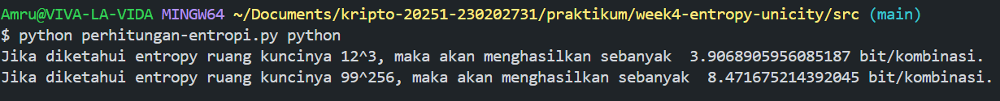
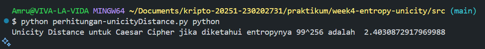
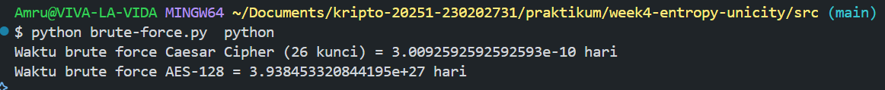

# Laporan Praktikum Kriptografi
Minggu ke-: 4  
Topik: Entropy & Unicity Distance (Evaluasi Kekuatan Kunci dan Brute Force)  
Nama: Amru Muiz Fauzan  
NIM: 230202731  
Kelas: 5IKRA  

---

## 1. Tujuan
```java
- Menyelesaikan perhitungan sederhana terkait entropi kunci.
- Menggunakan teorema Euler pada contoh perhitungan modular & invers.
- Menghitung unicity distance untuk ciphertext tertentu.
- Menganalisis kekuatan kunci berdasarkan entropi dan unicity distance.
- Mengevaluasi potensi serangan brute force pada kriptosistem sederhana.
```

---

## 2. Dasar Teori
Entropi dalam kriptografi merupakan ukuran matematis dari tingkat ketidakpastian atau kerandoman suatu kunci. Jika ruang kunci memiliki jumlah kemungkinan yang besar dan semua kunci memiliki probabilitas yang sama untuk digunakan, maka entropi akan tinggi, yang berarti sistem kriptografi lebih sulit ditembus melalui percobaan acak (brute force). Entropi kunci dihitung menggunakan rumus H(k) = Log basis2 * (N), di mana (N) adalah jumlah total dari kemungkinan kunci. Misal jika suatu cipher memiliki 2^128 kemungkinan kunci, maka entropinya adalah 128bit, yang menunjukkan bahwa dibutuhkan rata-rata 2^127 percobaan brute force untuk menebak kunci tersebut. Dalam konteks praktis, semakin tinggi entropi berarti tingkat keamanan suatu sistem semakin kuat, karena serangan brute force menjadi tidak realistis secara komputasional. Konsep ini juga berkaitan dengan kualitas generator bilangan acak dan distribusi probabilitas kunci, sehingga sistem dengan entropi rendah akan jauh lebih rentan terhadap prediksi kunci oleh penyerang.

Namun, tingkat keamanan cipher tidak hanya ditentukan oleh entropi, tetapi juga dipengaruhi oleh redundansi plaintext—yaitu adanya pola dan struktur bahasa alami yang membuat sebagian informasi dalam pesan bersifat dapat diprediksi. Redundansi muncul karena tidak semua kombinasi karakter digunakan secara merata dalam bahasa manusia; misalnya, bahasa Inggris memiliki redundansi sekitar 3,2 bit per karakter, yang menunjukkan bahwa sebagian besar pola teks dapat ditebak tanpa informasi penuh. Redundansi ini memungkinkan penyerang membedakan ciphertext yang benar dan yang salah berdasarkan kesesuaian pola hasil dekripsi dengan struktur bahasa alami. Konsep ini mengarah pada unicity distance, yaitu jumlah minimum ciphertext yang diperlukan untuk memastikan bahwa hanya satu kunci yang memberikan plaintext bermakna. Rumusnya U = H(k)/D, menunjukkan bahwa cipher dengan entropi tinggi dan redundansi rendah akan memiliki unicity distance besar, sehingga lebih tahan terhadap serangan. Cipher substitusi klasik, meskipun memiliki ruang kunci besar, memiliki redundansi plaintext tinggi, sehingga kunci dapat dipecahkan hanya dengan sejumlah kecil ciphertext.

Dalam konteks evaluasi kekuatan kunci, konsep entropy dan unicity distance digunakan untuk menganalisis sejauh mana cipher tahan terhadap brute force. Jika unicity distance rendah, maka penyerang hanya perlu mengumpulkan ciphertext dalam jumlah terbatas sebelum dapat membedakan kunci yang benar secara unik. Sebaliknya, algoritma modern seperti AES dan one-time pad memiliki entropi tinggi dan redundansi yang sangat rendah atau bahkan nol, menjadikannya tahan terhadap brute force secara teoritis maupun praktis. One-time pad merupakan kasus ideal dengan entropi tak terbatas karena setiap bit kunci bersifat acak dan hanya digunakan sekali dengan panjang yang sama dengan plaintext, membuat nilai unicity distance tak terhingga. Di sisi lain, brute force menjadi tidak relevan karena ciphertext tidak mengandung informasi yang dapat digunakan untuk menentukan kunci. Konsep-konsep tersebut tidak hanya penting untuk kriptografi simetris, tetapi juga menjadi dasar dalam kriptografi kunci publik, fungsi hash, HMAC, dan digital signature, di mana kekuatan sistem diukur berdasarkan entropi kunci dan kemampuan resistensi terhadap eksploitasi redundansi atau prediktabilitas. Dengan demikian, kombinasi entropi yang tinggi, redundansi rendah, dan unicity distance besar merupakan indikator utama kekuatan kriptografi modern di tengah peningkatan kemampuan komputasi global.

---

## 3. Alat dan Bahan
```
- Python 3.11
- Visual Studio Code
- Online Python - IDE
- Git dan akun GitHub  
```

---

## 4. Langkah Percobaan
```
1. Mencoba Perhitungan Entropi
2. Mencoba Perhitungan Unicity Distance
3. Melakukan Analisis Brute Force
```

---

## 5. Source Code
Mencoba perhitungan entropi!
```python
import math

def entropy(ukuran_keyspace):
    return math.log2(ukuran_keyspace)
    
print("Jika diketahui entropy ruang kuncinya 12^3, maka akan menghasilkan sebanyak ", entropy(12^3), "bit/kombinasi.")
print("Jika diketahui entropy ruang kuncinya 99^256, maka akan menghasilkan sebanyak ", entropy(99^256), "bit/kombinasi.")
```

Mencoba perhitungan unicity distance!
```python
import math

def entropy(ukuran_keyspace):
    return math.log2(ukuran_keyspace)
    
def unicity_distance(HK, R=0.75, A=26):
    return HK / (R * math.log2(A))

HK = entropy(99^256)
print("Unicity Distance untuk Caesar Cipher jika diketahui entropynya 99^256 adalah ", unicity_distance(HK))
```

Melakukan analisis dengan brute-force!
```python
def brute_force_time(keyspace_size, attempts_per_second=1e6):
    seconds = keyspace_size / attempts_per_second
    days = seconds / (3600*24)
    return days

print("Waktu brute force Caesar Cipher (26 kunci) =", brute_force_time(26), "hari")
print("Waktu brute force AES-128 =", brute_force_time(2**128), "hari")
```

---

## 6. Hasil dan Pembahasan




---

## 7. Jawaban Pertanyaan
``Pertanyaan 1: `` Entropy mencerminkan tingkat ketidakpastian atau kerandoman dalam suatu kunci kriptografi. Semakin tinggi entropy, semakin sulit kunci ditebak karena ruang kemungkinan kunci menjadi lebih besar dan acak, sehingga memperkuat keamanan terhadap serangan brute force.

``Pertanyaan 2: `` Unicity distance adalah jumlah minimum ciphertext yang diperlukan oleh penyerang untuk secara teoritis dapat menentukan kunci secara unik. Jika unicity distance tinggi, maka cipher dianggap lebih aman karena membutuhkan lebih banyak data terenkripsi sebelum kunci dapat diperkirakan secara pasti.

``Pertanyaan 3: `` Brute force tetap menjadi ancaman karena keamanan algoritma tidak menjamin keamanan implementasi. Jika panjang kunci lemah, entropy rendah, atau pengguna menggunakan kata sandi yang mudah ditebak, maka serangan brute force tetap dapat berhasil bahkan tanpa harus memecahkan struktur cipher itu sendiri.

---

## 8. Kesimpulan
Tingkat keamanan suatu sistem kriptografi tidak hanya ditentukan oleh ukuran kunci, tetapi oleh seberapa tinggi entropi dan seberapa rendah redundansi plaintext yang memengaruhi unicity distance. Entropi yang tinggi menunjukkan bahwa kunci bersifat acak dan sulit diprediksi, sehingga membuat brute force menjadi tidak praktis secara komputasional. Sementara itu, redundansi dalam plaintext dapat mengurangi keamanan karena memungkinkan penyerang mengidentifikasi pola dekripsi yang benar dengan lebih sedikit ciphertext. Melalui konsep unicity distance, dapat dinilai jumlah minimum ciphertext yang dibutuhkan untuk menentukan kunci secara unik; semakin besar nilainya, semakin kuat cipher tersebut. Oleh karena itu, cipher modern dirancang untuk memiliki entropi tinggi, redundansi rendah, dan unicity distance besar agar mampu memberikan perlindungan maksimal terhadap brute force maupun analisis kriptografis lainnya.

---

## 9. Daftar Pustaka
- Katz, J., & Lindell, Y. *Introduction to Modern Cryptography*.  
- Stallings, W. (2017). Cryptography and Network Security: Principles and Practice (7th ed.). Pearson.
- Shannon, C. E. (1949). Communication theory of secrecy systems. Bell System Technical Journal, 28(4), 656–715.
- Menezes, A. J., van Oorschot, P. C., & Vanstone, S. A. (1996). Handbook of Applied Cryptography. CRC Press.
- Katz, J., & Lindell, Y. (2020). Introduction to Modern Cryptography (3rd ed.). CRC Press.
- Diffie, W., & Hellman, M. (1976). New directions in cryptography. IEEE Transactions on Information Theory, 22(6), 644–654.

---

## 10. Commit Log
```
commit week4-entropy-unicity
Author: Amru Muiz Fauzan <amrumuzan092@gmail.com>
Date:   2025-10-22

    week4-entropy-unicity: Entropy & Unicity Distance )
```
