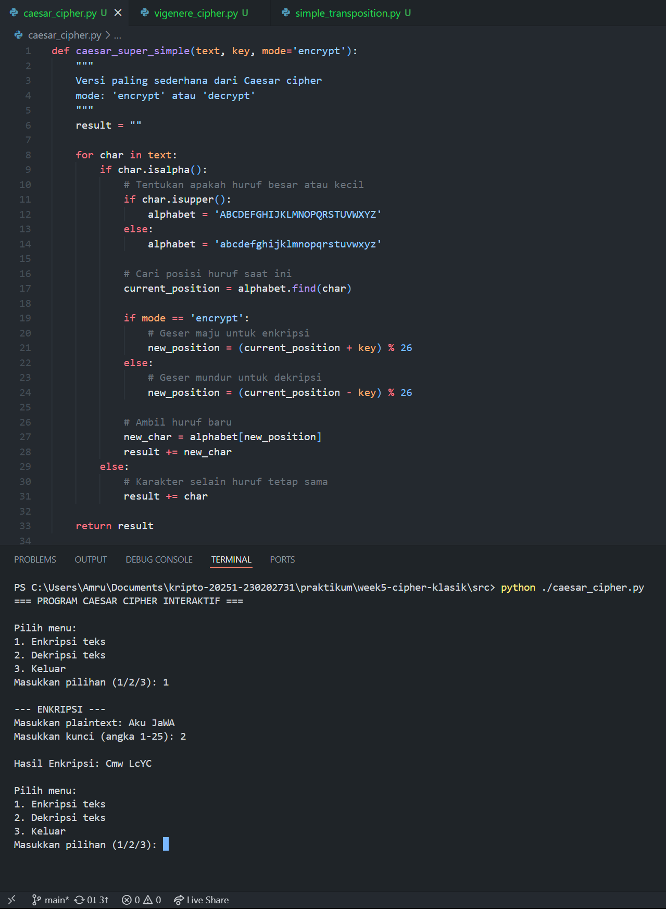
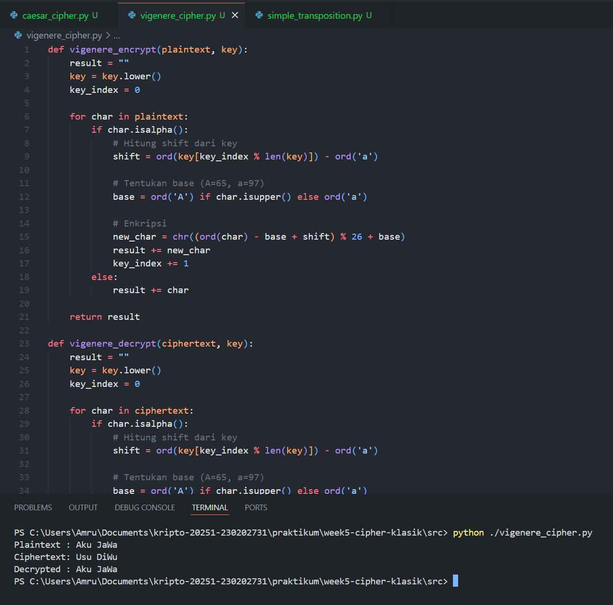
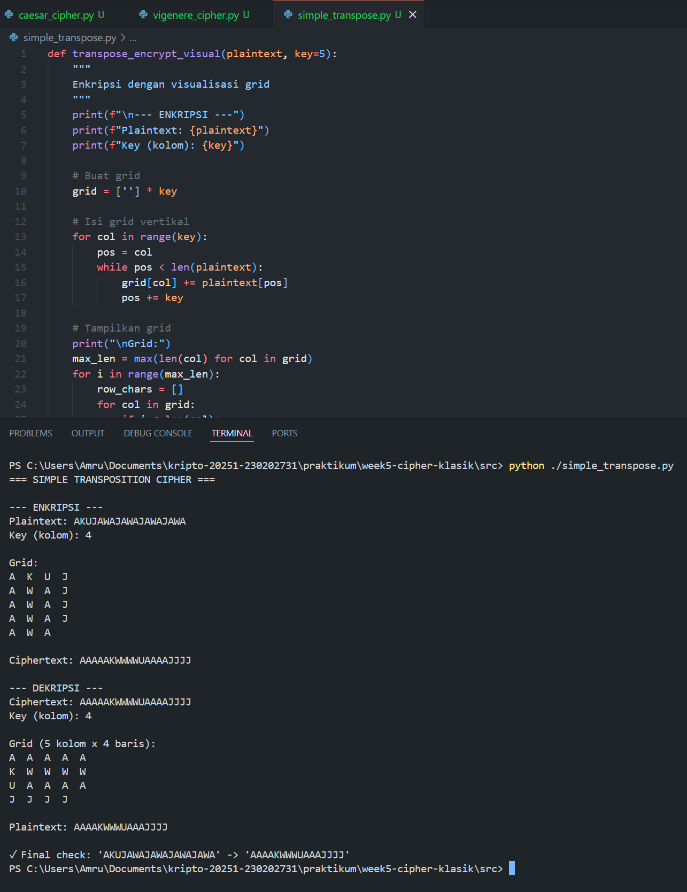

# Laporan Praktikum Kriptografi
Minggu ke-: 5
Topik: Cipher Klasik (Caesar, Vigenère, Transposisi)
Nama: Amru Muiz Fauzan
NIM: 230202731
Kelas: 5IKRA  

---

## 1. Tujuan
```
- Menerapkan algoritma Caesar Cipher untuk enkripsi dan dekripsi teks.
- Menerapkan algoritma Vigenère Cipher dengan variasi kunci.
- Mengimplementasikan algoritma transposisi sederhana.
- Menjelaskan kelemahan algoritma kriptografi klasik.
```

---

## 2. Dasar Teori
Cipher klasik merupakan teknik kriptografi generasi awal yang digunakan untuk menjaga kerahasiaan informasi dengan cara mengubah plaintext menjadi ciphertext menggunakan aturan tertentu. Secara umum, cipher klasik terbagi menjadi dua kategori utama, yaitu cipher substitusi dan cipher transposisi. Pada cipher substitusi, setiap huruf pada plaintext digantikan dengan huruf lain berdasarkan pola tertentu. Contoh sederhana adalah Caesar Cipher yang mengganti setiap huruf berdasarkan pergeseran alfabet tetap sebanyak k posisi. Sementara itu, Vigenère Cipher menggunakan kata kunci yang diulang sepanjang plaintext untuk menentukan jumlah pergeseran tiap karakter, sehingga bersifat polialfabetik. Berbeda dengan substitusi, pada cipher transposisi huruf-huruf pada plaintext tidak diganti melainkan diacak posisi atau urutannya, sehingga struktur huruf tetap tetapi susunannya berubah. Meskipun metode ini tergolong sederhana dan sangat berpengaruh dalam sejarah kriptografi, cipher klasik memiliki banyak kelemahan sehingga tidak lagi dianggap aman dalam sistem modern.

Kelemahan utama pada Caesar Cipher terletak pada ruang kunci yang sangat kecil—hanya 25 kemungkinan pergeseran—yang membuatnya sangat mudah dipecahkan menggunakan brute-force attack. Cipher ini juga tidak mengubah distribusi frekuensi huruf, sehingga huruf yang paling sering muncul di ciphertext tetap merepresentasikan huruf paling sering pada plaintext. Maka dari itu, analisis frekuensi dapat dengan mudah digunakan untuk membongkar pesan. Sementara itu, Vigenère Cipher memang lebih kuat karena bersifat polialfabetik, namun masih memiliki titik lemah apabila kunci yang digunakan pendek dan berulang. Struktur pengulangan kunci menghasilkan pola tertentu yang bisa dianalisis menggunakan metode Kasiski Examination atau Index of Coincidence. Setelah panjang kunci diketahui, ciphertext dapat dipisah berdasarkan posisi huruf kunci dan tiap bagian dapat dianalisis menggunakan frekuensi monoalfabetik. Dengan demikian, Caesar Cipher gagal karena keterbatasan kunci dan pola statis, sedangkan kelemahan terbesar Vigenère Cipher muncul saat kunci tidak acak atau terlalu pendek dibanding panjang pesan.

Cipher klasik pada umumnya sangat rentan terhadap analisis frekuensi karena bahasa manusia memiliki pola statistik yang konsisten. Misalnya, dalam Bahasa Inggris huruf seperti E, T, A, dan O muncul jauh lebih sering dibanding huruf Z atau Q. Cipher substitusi tidak merusak pola frekuensi huruf-huruf tersebut, hanya mengganti identitasnya. Akibatnya, siapa pun yang menganalisis ciphertext cukup menghitung frekuensi kemunculan huruf, lalu memetakannya dengan tabel statistik bahasa. Dalam kasus cipher polialfabetik seperti Vigenère Cipher, meskipun frekuensi huruf tidak langsung terlihat, pola pengulangan kunci akan menciptakan struktur yang dapat dikenali. Setelah panjang kunci ditemukan, setiap huruf dapat dianalisis seperti cipher substitusi tunggal (monoalfabetik). Artinya, selama cipher tidak mampu menyembunyikan pola statistik bahasa (baik frekuensi tunggal, bigram, maupun trigram), cipher tersebut dapat diretas dengan teknik analisis frekuensi.

Jika dibandingkan, cipher substitusi dan transposisi memiliki kelebihan dan kekurangannya masing-masing. Cipher substitusi mengganti identitas simbol, sehingga mudah diaplikasikan namun sangat rentan terhadap analisis statistik jika hanya menggunakan satu alfabet tetap. Polialfabetik seperti Vigenère Cipher memang memberikan peningkatan keamanan, tetapi tetap gagal melindungi pesan jika kunci pendek atau digunakan berulang. Cipher transposisi tidak mengganti huruf tetapi hanya mengacak urutannya, sehingga distribusi frekuensi huruf tetap utuh. Keuntungannya adalah struktur kata asli sulit dikenali secara langsung, tetapi kelemahannya adalah pola frekuensi tetap tersedia sehingga masih dapat dianalisis. Cipher transposisi juga dapat dipecahkan jika format kolom atau panjang blok diketahui. Karena cipher substitusi memberikan confusion (pengacakan makna) dan cipher transposisi memberi diffusion (pengacakan posisi), keduanya lebih kuat jika dikombinasikan bersama—konsep ini yang kemudian menjadi dasar desain cipher modern.

---

## 3. Alat dan Bahan
- Visual Studio Code
- Git dan akun GitHub  
- Python 3.11

---

## 4. Langkah Percobaan
1. Melakukan persiapan untuk implementasi cipher dengan python di VSC.
2. Implementasi pertama caesar-cipher.py.
3. Implementasi kedua vigenere-cipher.py.
4. Implementasi simple-transpose.py.
5. Mencari teori caesar cipher klasik dan dibuat rangkuman untuk dimasukkan ke bagian teori pada ``laporan.md``
6. Menjawab pertanyaan diskusi.
   
---

## 5. Source Code
**``Implementasi Caesar Cipher``**
```python
def caesar_super_simple(text, key, mode='encrypt'):
    """
    Versi paling sederhana dari Caesar cipher
    mode: 'encrypt' atau 'decrypt'
    """
    result = ""
    
    for char in text:
        if char.isalpha():
            # Tentukan apakah huruf besar atau kecil
            if char.isupper():
                alphabet = 'ABCDEFGHIJKLMNOPQRSTUVWXYZ'
            else:
                alphabet = 'abcdefghijklmnopqrstuvwxyz'
            
            # Cari posisi huruf saat ini
            current_position = alphabet.find(char)
            
            if mode == 'encrypt':
                # Geser maju untuk enkripsi
                new_position = (current_position + key) % 26
            else:
                # Geser mundur untuk dekripsi
                new_position = (current_position - key) % 26
            
            # Ambil huruf baru
            new_char = alphabet[new_position]
            result += new_char
        else:
            # Karakter selain huruf tetap sama
            result += char
    
    return result

def menu_interaktif():
    print("=== PROGRAM CAESAR CIPHER INTERAKTIF ===")
    
    while True:
        print("\nPilih menu:")
        print("1. Enkripsi teks")
        print("2. Dekripsi teks") 
        print("3. Keluar")
        
        pilihan = input("Masukkan pilihan (1/2/3): ")
        
        if pilihan == '1':
            # Enkripsi
            print("\n--- ENKRIPSI ---")
            plaintext = input("Masukkan plaintext: ")
            key = int(input("Masukkan kunci (angka 1-25): "))
            
            if key < 1 or key > 25:
                print("Kunci tidak valid! Menggunakan kunci 3.")
                key = 3
            
            ciphertext = caesar_super_simple(plaintext, key, 'encrypt')
            print(f"\nHasil Enkripsi: {ciphertext}")
            
        elif pilihan == '2':
            # Dekripsi
            print("\n--- DEKRIPSI ---")
            ciphertext = input("Masukkan ciphertext: ")
            key = int(input("Masukkan kunci (angka 1-25): "))
            
            if key < 1 or key > 25:
                print("Kunci tidak valid! Menggunakan kunci 3.")
                key = 3
            
            plaintext = caesar_super_simple(ciphertext, key, 'decrypt')
            print(f"\nHasil Dekripsi: {plaintext}")
            
        elif pilihan == '3':
            print("Terima kasih telah menggunakan program!")
            break
            
        else:
            print("Pilihan tidak valid! Silakan pilih 1, 2, atau 3.")

# Jalankan program
if __name__ == "__main__":
    menu_interaktif()
```

**``Implementasi Vigenere Cipher``**
```python
def vigenere_encrypt(plaintext, key):
    result = ""
    key = key.lower()
    key_index = 0
    
    for char in plaintext:
        if char.isalpha():
            # Hitung shift dari key
            shift = ord(key[key_index % len(key)]) - ord('a')
            
            # Tentukan base (A=65, a=97)
            base = ord('A') if char.isupper() else ord('a')
            
            # Enkripsi
            new_char = chr((ord(char) - base + shift) % 26 + base)
            result += new_char
            key_index += 1
        else:
            result += char
    
    return result

def vigenere_decrypt(ciphertext, key):
    result = ""
    key = key.lower()
    key_index = 0
    
    for char in ciphertext:
        if char.isalpha():
            # Hitung shift dari key
            shift = ord(key[key_index % len(key)]) - ord('a')
            
            # Tentukan base (A=65, a=97)
            base = ord('A') if char.isupper() else ord('a')
            
            # Dekripsi
            new_char = chr((ord(char) - base - shift) % 26 + base)
            result += new_char
            key_index += 1
        else:
            result += char
    
    return result

# testing
msg = "Aku JaWa"
key = "UIA"

enc = vigenere_encrypt(msg, key)
dec = vigenere_decrypt(enc, key)

print("Plaintext :", msg)
print("Ciphertext:", enc)
print("Decrypted :", dec)
```

**``Implementasi Transposisi Sederhana``**
```python
def transpose_encrypt_visual(plaintext, key=5):
    """
    Enkripsi dengan visualisasi grid
    """
    print(f"\n--- ENKRIPSI ---")
    print(f"Plaintext: {plaintext}")
    print(f"Key (kolom): {key}")
    
    # Buat grid
    grid = [''] * key
    
    # Isi grid vertikal
    for col in range(key):
        pos = col
        while pos < len(plaintext):
            grid[col] += plaintext[pos]
            pos += key
    
    # Tampilkan grid
    print("\nGrid:")
    max_len = max(len(col) for col in grid)
    for i in range(max_len):
        row_chars = []
        for col in grid:
            if i < len(col):
                row_chars.append(col[i])
            else:
                row_chars.append(' ')
        print("  ".join(row_chars))
    
    ciphertext = ''.join(grid)
    print(f"\nCiphertext: {ciphertext}")
    return ciphertext

def transpose_decrypt_visual(ciphertext, key=5):
    """
    Dekripsi dengan visualisasi
    """
    print(f"\n--- DEKRIPSI ---")
    print(f"Ciphertext: {ciphertext}")
    print(f"Key (kolom): {key}")
    
    total_chars = len(ciphertext)
    num_cols = (total_chars + key - 1) // key
    num_rows = key
    empty_cells = (num_cols * num_rows) - total_chars
    
    # Buat grid horizontal
    grid = [''] * num_cols
    col, row = 0, 0
    
    for char in ciphertext:
        grid[col] += char
        col += 1
        if (col == num_cols) or (col == num_cols - 1 and row >= num_rows - empty_cells):
            col = 0
            row += 1
    
    # Tampilkan grid
    print(f"\nGrid ({num_cols} kolom x {num_rows} baris):")
    for i in range(num_rows):
        row_chars = []
        for j in range(num_cols):
            if i < len(grid[j]):
                row_chars.append(grid[j][i])
            else:
                row_chars.append(' ')
        print("  ".join(row_chars))
    
    # Baca vertikal
    plaintext = ''
    for i in range(num_cols):
        for j in range(num_rows):
            if i < len(grid[j]):
                plaintext += grid[j][i]
    
    print(f"\nPlaintext: {plaintext}")
    return plaintext

# testing
print("=== SIMPLE TRANSPOSITION CIPHER ===")
msg = "AKUJAWAJAWAJAWAJAWA"
key = 4

enc = transpose_encrypt_visual(msg, key)
dec = transpose_decrypt_visual(enc, key)

print(f"\n✓ Final check: '{msg}' -> '{dec}'")
```

---

## 6. Hasil dan Pembahasan




---

## 7. Jawaban Pertanyaan
1. Pertanyaan 1: Kelemahan Caesar Cipher dan Vigenere Cipher. Untuk ``Caesar Cipher`` kelemahannya mudah ditebak/ _brute-force_ , tidak mengubah distribusi frekuensi pada huruf-hurufnya, dan kelemahan lainnya juga tidak tahan dengan analisis statistik. Sedangkan untuk ``Vigenere Cipher`` kelemahannya justru pada perulangan pada pola kunci jika dilakukan analisis frekuensi/ metode statistik.
2. Pertanyaan 2: Cipher klasik mudah diserang dengan analisis frekuensi adalah pernyataan yang bisa dibilang tepat. Karena bahasa alami  (bahasa Inggris/ bahasa Indonesia) punya distribusi huruf yang tidak seragam. Teknik substitusi yang tidak mengubah pola relatif (monoalfabetik) hanya mengubah identitas simbol, bukan frekuensi relatifnya. Oleh karena itu, pemetaan frekuensi ciphertext menjadi plaintext bisa memberi petunjuk kuat tentang substitusi yang digunakan. Bahkan untuk sistem polialfabetik seperti Vigenere, jika ada pengulangan kunci atau struktur, analisis frekuensi bisa diterapkan setelah memisahkan ciphertext menjadi sisi-sisi yang dibentuk oleh setiap huruf kunci. Dengan metode seperti Kasiski examination dan Index of Coincidence (Friedman) bisa digunakan untuk menemukan panjang kunci sehingga analisis frekuensi dapat dieksekusi pada setiap subsekuen.
3. Pertanyaan 3: Perbandingan kelebihan + kelemahan dari Cipher Substitusi dengan Transposisi
Substitusi, kelebihan mudah diimplementasikan secara manual. Polialfabetik (Vigenère) bisa memecah keterkaitan langsung antara huruf plaintext dan ciphertext sehingga lebih kuat dibanding monoalfabetik.Sedangkan bagian kelemahannya justru karena monoalfabetik rentan terhadap analisis frekuensi dan polialfabetik rentan kalau kunci pendek/diulang (distribusi akhir masih mengandung pola jika kunci tidak ideal). Umumnya tidak mengubah urutan huruf → struktur kata (pattern) tetap ada (mis. pola kata seperti “THERE” bisa dikenali lewat pola pengulangan huruf).
Transposisi, punya kelebihan buat mengubah urutan huruf, sehingga statistik frekuensi huruf tetap sama (huruf-huruf muncul sama jumlahnya) tapi struktur tata kata dan posisi diacak. Jika dikombinasikan dengan substitusi (menjadi hybrid cipher), maka keamanan meningkat signifikan. Mengenai kelemahannya, karena frekuensi huruf tetap, analisis berbasis frekuensi masih bisa dimanfaatkan. Jika hanya transposisi sederhana (mis. kolom sederhana), pola pozisi dan indikator panjang blok dapat dieksploitasi untuk membalikkan transposisi. Serta untuk implementasi manual agar transposisinya kuat (banyak lapis) itu bisa sangat merepotkan.

---

## 8. Kesimpulan
Cipher klasik seperti Caesar dan Vigenère Cipher penting sebagai dasar sejarah kriptografi, namun secara keamanan sudah tidak relevan digunakan karena masih mempertahankan pola statistik bahasa sehingga mudah dipecahkan dengan analisis frekuensi. Caesar Cipher sangat lemah karena ruang kunci kecil dan pola huruf tidak berubah, sedangkan Vigenère Cipher sedikit lebih kuat tetapi tetap dapat ditembus jika kunci pendek atau berulang. Baik cipher substitusi maupun transposisi memiliki kelemahan masing-masing—substitusi menyamarkan huruf tetapi tetap mempertahankan struktur kata, sedangkan transposisi mengacak urutan tetapi tidak menyembunyikan frekuensi huruf—sehingga keduanya belum mampu memberikan perlindungan yang kuat jika berdiri sendiri. Kesimpulannya, cipher klasik lebih bernilai sebagai fondasi teori dan pembelajaran, sementara keamanan modern membutuhkan kombinasi confusion dan diffusion seperti pada cipher masa kini (AES, DES, dan sejenisnya).

---

## 9. Daftar Pustaka
```java
- Katz, J., & Lindell, Y. *Introduction to Modern Cryptography*.  
- Stallings, W. (2006). Network Security Essentials: Applications and Standards (3rd ed.). Prentice Hall.
- Kahn, D. (1967). The Codebreakers: The Story of Secret Writing. New York: Macmillan.
- Shannon, C. E. (1949). Communication theory of secrecy systems. Bell System Technical Journal, 28(4), 656–715.
- Friedman, W. F. (1922). The Index of Coincidence and Its Applications in Cryptology. Riverbank Publications.
- Singh, S. (1999). The Code Book: The Science of Secrecy from Ancient Egypt to Quantum Cryptography. Anchor Books.
```

---

## 10. Commit Log
(Tuliskan bukti commit Git yang relevan.  
Contoh:
```
commit week5-cipher-klasik
Author: Amru Muiz Fauzan <amrumuzan092@gmail.com>
Date:   2025-11-02

    week5-cipher-klasik: implementasi caesar-cipher, vigenere-cipher, simple-transposition dan laporan singkat.
```
