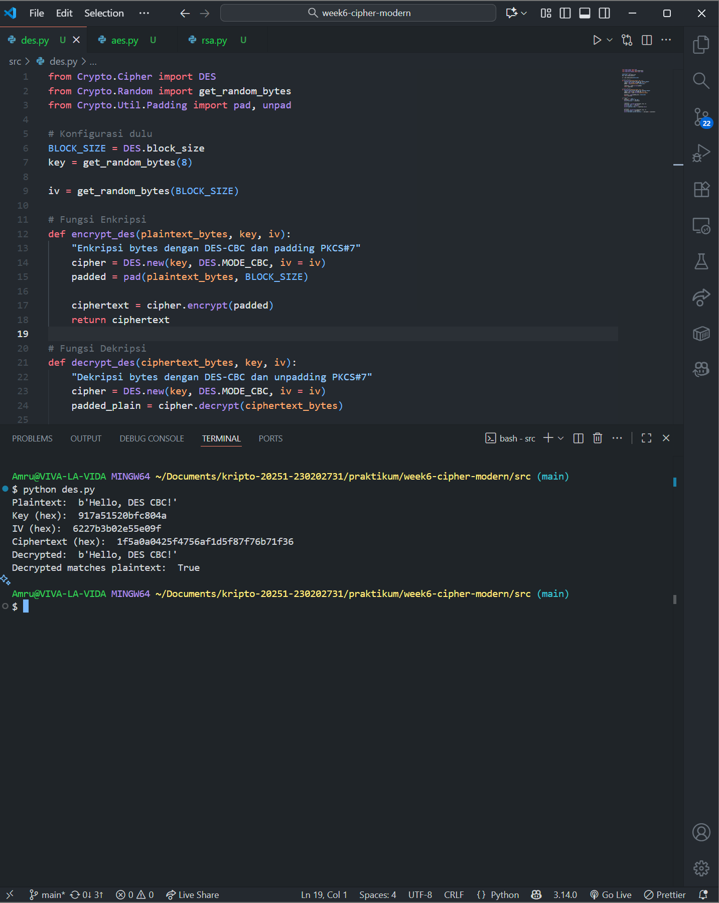
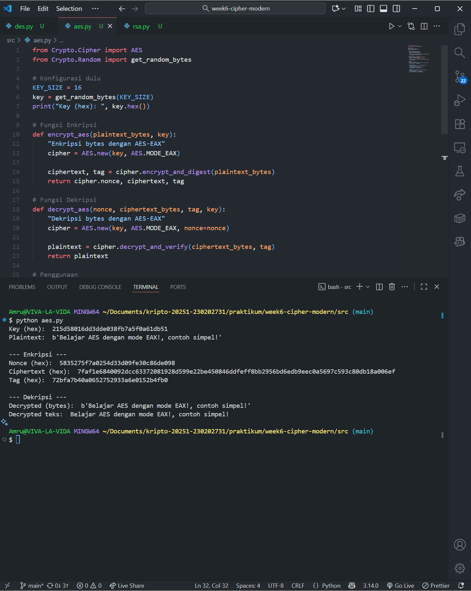

# Laporan Praktikum Kriptografi
Minggu ke-: 6
Topik: Cipher Modern (DES, AES, RSA)
Nama: Amru Muiz Fauzan
NIM: 230202731
Kelas: 5IKRA  

---

## 1. Tujuan
```md
- Mengimplementasikan algoritma DES untuk blok data sederhana.
- Menerapkan algoritma AES dengan panjang kunci 128 bit.
- Menjelaskan proses pembangkitan kunci publik dan privat pada algoritma RSA.
```

---

## 2. Dasar Teori
Algoritma kriptografi modern seperti DES, AES-128, dan RSA memiliki peranan penting dalam pengamanan data. Data Encryption Standard (DES) merupakan algoritma kriptografi simetris yang mengandalkan satu kunci yang sama untuk proses enkripsi dan dekripsi. DES menggunakan kunci 56-bit dan memproses data dalam blok 64-bit, namun kunci yang relatif pendek ini membuat DES rentan terhadap serangan brute force sehingga tidak lagi direkomendasikan untuk penggunaan modern. Sebagai pengganti, Advanced Encryption Standard (AES) dikembangkan dengan tiga varian kunci yaitu 128, 192, dan 256 bit, yang memberikan keamanan lebih tinggi dan efisiensi komputasi yang baik. AES-128, khususnya, memproses data dalam blok 128-bit dan menggunakan operasi substitusi dan permutasi yang kompleks dalam beberapa ronde, sehingga jauh lebih tahan terhadap serangan dibandingkan DES. Sementara itu, RSA adalah algoritma kriptografi asimetris yang menggunakan sepasang kunci publik dan privat untuk enkripsi dan dekripsi. Berbeda dengan DES dan AES yang simetris, RSA berdasarkan pada kesulitan masalah faktorisasi bilangan besar, sehingga kunci privat tidak dapat dengan mudah dihitung dari kunci publik. RSA digunakan terutama untuk pertukaran kunci, tanda tangan digital, dan enkripsi data yang membutuhkan keamanan tingkat tinggi, meskipun kecepatan enkripsi dan dekripsinya lebih lambat dibanding algoritma simetris seperti AES.

AES lebih banyak digunakan dibanding DES di era modern karena beberapa alasan utama. Pertama, AES memiliki ukuran kunci yang lebih besar dan struktur algoritmik yang lebih kuat, sehingga memberikan keamanan yang jauh lebih tinggi terhadap serangan brute force dan analisis kriptanalisis lainnya. Kedua, AES dirancang untuk efisiensi software dan hardware, memungkinkan implementasi cepat pada berbagai perangkat, mulai dari komputer hingga perangkat mobile dan embedded systems. Selain itu, AES merupakan standar enkripsi yang disetujui oleh banyak badan keamanan dunia, termasuk National Institute of Standards and Technology (NIST), sehingga memiliki dukungan luas dan kepercayaan lebih tinggi daripada DES yang kini sudah dianggap tidak cukup aman. Algoritma DES sendiri telah resmi digantikan oleh AES sebagai standar enkripsi simetris modern sejak tahun 2001.

RSA dikategorikan sebagai algoritma asimetris karena menggunakan sepasang kunci yang berbeda tapi terkait secara matematis: kunci publik untuk enkripsi dan kunci privat untuk dekripsi. Proses pembangkitan kunci RSA dimulai dengan pemilihan dua bilangan prima besar secara acak, lalu menghitung hasil kali dari kedua bilangan tersebut untuk memperoleh modulus n. Fungsi totien Euler dari n dihitung dan kemudian dipilih sebuah bilangan bulat e sebagai eksponen publik yang relatif prima dengan totien tersebut. Selanjutnya nilai d dihitung sebagai kebalikan modular dari e, yang fungsinya untuk eksponen privat. Oleh karena sifat matematis ini, mengetahui kunci publik tidak memungkinkan penyerang dengan mudah buat menghitung kunci privat tanpa memfaktorkan nilai n yang sangat besar, sehingga menjadikan RSA begitu sangat aman asalkan bilangan prima yang dipili itu besar.

---

## 3. Alat dan Bahan
```python
- Python 3.11
- Visual Studio Code
- Git dan akun GitHub  
- Pycryptodome
```

---

## 4. Langkah Percobaan
1. Mengimplementasikan DES (Opsional, Simulasi) ke dalam program ``python``.
2. Mengimplementasikan AES-128 ke dalam program ``python``.
3. Mengimplementasikan RSA ke dalam program ``python``.
4. Menjawab pertanyaan diskusi.
5. Membuat ``laporan.md`` yang berisi ringkasan teori tentang algoritma modern.

---

## 5. Source Code
DES :
```python
from Crypto.Cipher import DES
from Crypto.Random import get_random_bytes
from Crypto.Util.Padding import pad, unpad

# Konfigurasi dulu
BLOCK_SIZE = DES.block_size
key = get_random_bytes(8)

iv = get_random_bytes(BLOCK_SIZE)

# Fungsi Enkripsi
def encrypt_des(plaintext_bytes, key, iv):
    "Enkripsi bytes dengan DES-CBC dan padding PKCS#7"
    cipher = DES.new(key, DES.MODE_CBC, iv = iv)
    padded = pad(plaintext_bytes, BLOCK_SIZE)

    ciphertext = cipher.encrypt(padded)
    return ciphertext

# Fungsi Dekripsi
def decrypt_des(ciphertext_bytes, key, iv):
    "Dekripsi bytes dengan DES-CBC dan unpadding PKCS#7"
    cipher = DES.new(key, DES.MODE_CBC, iv = iv)
    padded_plain = cipher.decrypt(ciphertext_bytes)

    plaintext = unpad(padded_plain, BLOCK_SIZE)
    return plaintext

# Penggunaan
if __name__ == "__main__":
    plaintext = b"Hello, DES CBC!"
    print("Plaintext: ", plaintext)

    # Enkripsi
    ciphertext = encrypt_des(plaintext, key, iv)
    print("Key (hex): ", key.hex())
    print("IV (hex): ", iv.hex())
    print("Ciphertext (hex): ", ciphertext.hex())

    # Dekripsi
    decrypted = decrypt_des(ciphertext, key, iv)
    print("Decrypted: ", decrypted)
    print("Decrypted matches plaintext: ", decrypted == plaintext)
```

AES :
```python
from Crypto.Cipher import AES
from Crypto.Random import get_random_bytes

# Konfigurasi dulu
KEY_SIZE = 16
key = get_random_bytes(KEY_SIZE)
print("Key (hex): ", key.hex())

# Fungsi Enkripsi
def encrypt_aes(plaintext_bytes, key):
    "Enkripsi bytes dengan AES-EAX"
    cipher = AES.new(key, AES.MODE_EAX)

    ciphertext, tag = cipher.encrypt_and_digest(plaintext_bytes)
    return cipher.nonce, ciphertext, tag

# Fungsi Dekripsi
def decrypt_aes(nonce, ciphertext_bytes, tag, key):
    "Dekripsi bytes dengan AES-EAX"
    cipher = AES.new(key, AES.MODE_EAX, nonce=nonce)

    plaintext = cipher.decrypt_and_verify(ciphertext_bytes, tag)
    return plaintext

# Penggunaan
if __name__ == "__main__":
    plaintext = b"Belajar AES dengan mode EAX!, contoh simpel!"
    print("Plaintext: ", plaintext)

    # Enkripsi
    nonce, ciphertext, tag = encrypt_aes(plaintext, key)
    print("\n--- Enkripsi ---")
    print("Nonce (hex): ", nonce.hex())
    print("Ciphertext (hex): ", ciphertext.hex())
    print("Tag (hex): ", tag.hex())

    # Dekripsi
    decrypted = decrypt_aes(nonce, ciphertext, tag, key)
    print("\n--- Dekripsi ---")
    print("Decrypted (bytes): ", decrypted)
    print("Decrypted teks: ", decrypted.decode())
```

RSA : 
```python
from Crypto.PublicKey import RSA
from Crypto.Cipher import PKCS1_OAEP

# Generate dulu pasangan kunci RSA-nya dan disimpan ke file!
key = RSA.generate(2048)
private_key = key.export_key()
public_key = key.publickey().export_key()

with open("private.pem", "wb") as private_file:
    private_file.write(private_key)

with open("public.pem", "wb") as public_file:
    public_file.write(public_key)

print("✅ | Pasangan kunci RSA telah dibuat dan disimpan ke file 'private.pem' dan 'public.pem'.")

# Baca kunci dari file
with open("private.pem", "rb") as private_file:
    private_key = RSA.import_key(private_file.read())

with open("public.pem", "rb") as public_file:
    public_key = RSA.import_key(public_file.read())

print("✅ | Kunci RSA telah dibaca dari file.")

# Enkripsi dengan public key
plaintext = b"Belajar RSA pakai PyCryptodome! gini caranya."
cipher_rsa = PKCS1_OAEP.new(public_key)
ciphertext = cipher_rsa.encrypt(plaintext)

print("\n--- Enkripsi ---")
print("Ciphertext (hex): ", ciphertext.hex())

# Dekripsi dengan private key
cipher_rsa = PKCS1_OAEP.new(private_key)
decrypted = cipher_rsa.decrypt(ciphertext)

print("\n--- Dekripsi ---")
print("Decrypted (bytes): ", decrypted)
print("Decrypted teks: ", decrypted.decode())
```

---

## 6. Hasil dan Pembahasan
``DES-CIPHER``


``AES-CIPHER``


``RSA-CIPHER``


---

## 7. Jawaban Pertanyaan
- Pertanyaan 1: DES dan AES adalah algoritma simetris dengan satu kunci yang sama untuk enkripsi dan dekripsi (AES menggunakan kunci lebih panjang dan blok data lebih besar), sedangkan RSA adalah algoritma asimetris yang memakai pasangan kunci publik dan privat, dengan keamanan berdasarkan faktorisasi bilangan besar.
- Pertanyaan 2: AES memiliki ukuran kunci yang lebih besar dan lebih tahan terhadap serangan brute force, serta efisiensi tinggi dalam perangkat keras dan perangkat lunak, sementara DES sudah dianggap tidak aman karena kunci 56-bitnya terlalu pendek.
- Pertanyaan 3: RSA menggunakan dua kunci berbeda (publik dan privat) yang secara matematis terkait; prosesnya melibatkan pemilihan dua bilangan prima besar, perhitungan modulus, fungsi totien Euler, dan eksponen publik serta privat yang digunakan untuk enkripsi dan dekripsi.

---

## 8. Kesimpulan
AES, DES, dan RSA masing-masing mengisi kebutuhan keamanan yang berbeda dalam sistem kriptografi modern, dengan AES menjadi pilihan utama untuk enkripsi simetris berkat keamanan dan efisiensinya, sedangkan RSA tetap krusial untuk komunikasi yang aman menggunakan kriptografi kunci publik. Kombinasi keduanya sering digunakan bersama dalam protokol keamanan modern untuk memanfaatkan keunggulan masing-masing algoritma.

---

## 9. Daftar Pustaka
```python
- Stallings, W. (2017). Cryptography and Network Security: Principles and Practice (7th ed.). Pearson.
- Katz, J., & Lindell, Y. (2020). Introduction to Modern Cryptography (3rd ed.). CRC Press.
- Menezes, A. J., van Oorschot, P. C., & Vanstone, S. A. (1996). Handbook of Applied Cryptography. CRC Press. (Open Access: https://cacr.uwaterloo.ca/hac/)
- Daemen, J., & Rijmen, V. (2002). The Design of Rijndael: AES - The Advanced Encryption Standard. Springer-Verlag.
```

---

## 10. Commit Log
```
commit week6-cipher-modern
Author: Amru Muiz Fauzan <amrumuzan092@gmail.com>
Date:   2025-11-10

    week6-cipher-modern: implementasi program python dan laporan.
```
