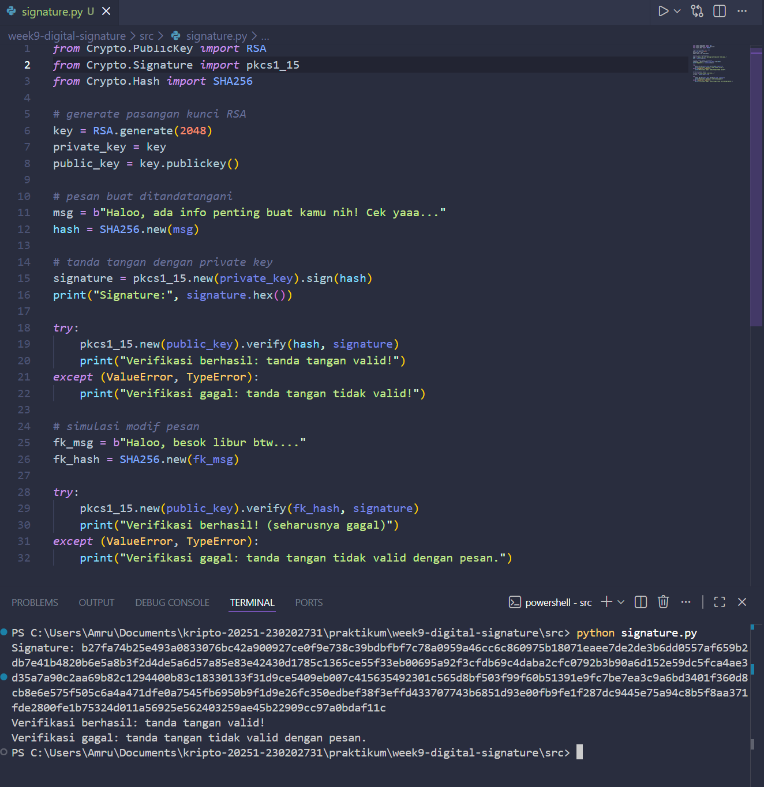

# Laporan Praktikum Kriptografi
Minggu ke-: 9
Topik: Digital Signature (RSA/DSA)
Nama: Amru Muiz Fauzan
NIM: 230202731
Kelas: 5IKRA  

---

## 1. Tujuan
```
- Mengimplementasikan tanda tangan digital menggunakan algoritma RSA/DSA.
- Memverifikasi keaslian tanda tangan digital.
- Menjelaskan manfaat tanda tangan digital dalam otentikasi pesan dan integritas data.
```

---

## 2. Dasar Teori
Tanda tangan digital merupakan bentuk elektronik dari tanda tangan tulis yang memanfaatkan kriptografi kunci publik untuk memverifikasi identitas penandatangan dan integritas data, sehingga menyediakan layanan keamanan seperti autentikasi asal data, integritas pesan, dan non-repudiasi yang mencegah penyangkalan oleh penandatangan. Penjelasan dasar menunjukkan bahwa tanda tangan digital dibuat dengan mengenkripsi hash dari dokumen menggunakan kunci privat penandatangan, menghasilkan string bit unik yang hanya dapat diverifikasi oleh kunci publik yang sesuai, sebagaimana diuraikan dalam prinsip dasar skema seperti RSA di mana pesan dienkripsi dengan eksponen privat untuk pembuatan tanda tangan. Kegunaannya meliputi penggantian tanda tangan basah dalam dokumen elektronik seperti email, transfer dana, pertukaran data, dan distribusi perangkat lunak, sementara manfaat utamanya mencakup efisiensi proses tanpa kebutuhan kertas, pengurangan risiko pemalsuan karena deteksi modifikasi data, serta kepatuhan terhadap standar keamanan pemerintah seperti yang ditetapkan NIST untuk informasi sensitif.

Manfaat tanda tangan digital semakin nyata dalam konteks modern karena kemampuannya menjaga kerahasiaan kunci privat sambil memungkinkan verifikasi publik yang cepat, misalnya pada skema RSA di mana verifikasi efisien dengan eksponen publik kecil, sehingga menghemat waktu dibandingkan proses tanda tangan manual. Selain itu, algoritma seperti DSA dan ECDSA dari standar federal menawarkan ukuran kunci lebih pendek—seperti 256-512 bit pada ECDSA setara keamanan 3072-15360 bit RSA—yang meningkatkan performa komputasi tanpa mengorbankan keamanan terhadap serangan eksistensial forgery melalui padding scheme. Kegunaan praktisnya terbukti dalam aplikasi pemerintahan dan komersial, di mana non-repudiasi memungkinkan bukti hukum bahwa dokumen tidak diubah pasca-penandatanganan, sebagaimana dijelaskan dalam kerangka keamanan yang mengintegrasikan hash seperti SHA-256 untuk digest pesan.

Cara kerja tanda tangan digital secara sederhana dimulai dengan pembuatan pasangan kunci publik-privat, diikuti pembuatan hash dokumen menggunakan fungsi seperti SHA, kemudian enkripsi hash tersebut dengan kunci privat untuk membentuk tanda tangan yang dilampirkan ke dokumen. Saat verifikasi, penerima menghitung ulang hash dokumen, mendekripsi tanda tangan dengan kunci publik untuk mendapatkan hash asli, dan membandingkannya; kecocokan menandakan integritas dan autentisitas, seperti pada protokol RSA di mana s = x^d mod n untuk signing dan x' = s^e mod n untuk verifikasi. Proses ini didukung domain parameter seperti pada DSA (p, q, g) atau kurva eliptik pada ECDSA, memastikan keamanan jangka panjang dengan ukuran modulus minimal 2048 bit atau lebih untuk mencegah pemecahan kriptanalitik.

---

## 3. Alat dan Bahan
```python
- Visual Studio Code
- Git dan akun GitHub  
- Python 3.11
```

---

## 4. Langkah Percobaan
```python
- Buat program python terkait pembuatan tanda tangan digital dan verifikasi tanda tangan digital
- Demo output program pythonnya
- Buat laporan.md
```

---

## 5. Source Code
```python
from Crypto.PublicKey import RSA
from Crypto.Signature import pkcs1_15
from Crypto.Hash import SHA256

# generate pasangan kunci RSA
key = RSA.generate(2048)
private_key = key
public_key = key.publickey()

# pesan buat ditandatangani
msg = b"Haloo, ada info penting buat kamu nih! Cek yaaa..."
hash = SHA256.new(msg)

# tanda tangan dengan private key
signature = pkcs1_15.new(private_key).sign(hash)
print("Signature:", signature.hex())

try:
    pkcs1_15.new(public_key).verify(hash, signature)
    print("Verifikasi berhasil: tanda tangan valid!")
except (ValueError, TypeError):
    print("Verifikasi gagal: tanda tangan tidak valid!")

# simulasi modif pesan
fk_msg = b"Haloo, besok libur btw...."
fk_hash = SHA256.new(fk_msg)

try: 
    pkcs1_15.new(public_key).verify(fk_hash, signature)
    print("Verifikasi berhasil! (seharusnya gagal)")
except (ValueError, TypeError):
    print("Verifikasi gagal: tanda tangan tidak valid dengan pesan.")
```

---

## 6. Hasil dan Pembahasan


---

## 7. Jawaban Pertanyaan
```
- Pertanyaan 1: Apa perbedaan utama antara enkripsi RSA dan tanda tangan digital RSA?
- Pertanyaan 2: Mengapa tanda tangan digital menjamin integritas dan otentikasi pesan?
- Pertanyaan 3: Bagaimana peran Certificate Authority (CA) dalam sistem tanda tangan digital modern?
```
1. Enkripsi RSA pake kunci publik buat menyembunyikan data (confidentiality), sedangkan tanda tangan digital RSA pake kunci privat buat menandatangani hash data (autentikasi dan integritas), dengan kunci publik untuk verifikasi.​
2. Integritas terjamin karena hash data yang ditandatangani akan berubah jika data dimodifikasi, sementara otentikasi karena hanya pemilik kunci privat yang bisa membuat tanda tangan valid yang diverifikasi kunci publik.​
3. CA mengeluarkan dan memverifikasi sertifikat digital yang mengikat kunci publik ke identitas pemilik, mencegah pemalsuan dan membangun

---

## 8. Kesimpulan
Tanda tangan digital adalah solusi kriptografi kunci publik yang esensial untuk autentikasi, integritas data, dan non-repudiasi pada dokumen elektronik, bekerja dengan mengenkripsi hash pesan menggunakan kunci privat untuk verifikasi via kunci publik, sehingga menggantikan tanda tangan manual secara aman dan efisien. Kegunaannya luas dalam email, transaksi keuangan, dan kontrak digital, sementara manfaatnya mencakup penghematan waktu, pengurangan pemalsuan, serta kepatuhan standar seperti NIST DSS dengan algoritma RSA, DSA, atau ECDSA yang menjamin keamanan tinggi terhadap serangan. Secara sederhana, prosesnya melibatkan pembuatan pasangan kunci, hashing dokumen, signing, dan verifikasi perbandingan hash, menjadikannya alat vital di era digital untuk kepercayaan dan efisiensi tanpa kertas.

---

## 9. Daftar Pustaka
```
- Paar, C., & Pelzl, J. (2010). Understanding cryptography: A textbook for students and practitioners (Chapter 10: Digital signatures). Springer. https://uim.fei.stuba.sk/wp-content/uploads/2018/02/Understanding_Cryptography_Chptr_10-Digital-signatures-2.pdf​
- National Institute of Standards and Technology. (2013). Digital Signature Standard (DSS) (FIPS PUB 186-4). U.S. Department of Commerce. https://nvlpubs.nist.gov/nistpubs/fips/nist.fips.186-4.pdf​
- National Institute of Standards and Technology. (2023). Digital Signatures | CSRC. https://csrc.nist.gov/projects/digital-signatures ​ 
```

---

## 10. Commit Log
```
commit week9-digital-signature
Author: Amru Muiz Fauzan <amrumuzan092@gmail.com>
Date:   2025-12-09

    week9-digital-signature: implementasi program python tanda tangan digital dan menyelesaikan laporan.md
```
